# HRMS Entity-Relationship Diagram

**Schema:** HRMS  **DB:** Oracle 19c  **Extracted:** 2026-08-04  
**Method:** CODE-ONLY (sqlplus not found on PATH; no Oracle instant client)

---

## Formal FK Relationships (Mermaid ERD)

```mermaid
erDiagram
    DEPARTMENTS {
        NUMBER(10) DEPT_ID PK
        VARCHAR2(20) DEPT_CODE UK
        VARCHAR2(100) DEPT_NAME
        NUMBER(10) PARENT_DEPT_ID "self-ref (soft)"
        VARCHAR2(20) COST_CENTER
        NUMBER(10) MANAGER_EMP_ID "soft ref"
        VARCHAR2(10) LOCATION_CODE "soft ref"
        CHAR(1) ACTIVE_FLAG
    }

    LOCATIONS {
        VARCHAR2(10) LOCATION_CODE PK
        VARCHAR2(100) LOCATION_NAME
        VARCHAR2(100) CITY
        VARCHAR2(100) STATE_PROVINCE
        VARCHAR2(3) COUNTRY_CODE
        VARCHAR2(50) TIMEZONE
    }

    JOB_GRADES {
        NUMBER(5) GRADE_ID PK
        VARCHAR2(10) GRADE_CODE UK
        VARCHAR2(50) GRADE_NAME
        NUMBER(12_2) MIN_SALARY
        NUMBER(12_2) MAX_SALARY
        CHAR(1) OVERTIME_ELIGIBLE
    }

    JOB_TITLES {
        NUMBER(10) JOB_ID PK
        VARCHAR2(20) JOB_CODE UK
        VARCHAR2(100) JOB_TITLE
        VARCHAR2(50) JOB_FAMILY
        NUMBER(5) GRADE_ID FK
        VARCHAR2(10) EEO_CATEGORY
        VARCHAR2(10) FLSA_STATUS
    }

    EMPLOYEES {
        NUMBER(10) EMP_ID PK
        VARCHAR2(20) EMP_NUMBER UK
        VARCHAR2(50) FIRST_NAME
        VARCHAR2(50) LAST_NAME
        DATE DATE_OF_BIRTH
        VARCHAR2(200) SSN_ENCRYPTED "AES-256"
        VARCHAR2(100) EMAIL
        DATE HIRE_DATE
        DATE TERMINATION_DATE
        NUMBER(10) DEPT_ID FK
        NUMBER(10) JOB_ID FK
        NUMBER(10) MANAGER_EMP_ID FK
        VARCHAR2(10) LOCATION_CODE FK
        VARCHAR2(20) EMPLOYMENT_STATUS
        BLOB PHOTO_BLOB
        CLOB NOTES
        CHAR(1) ACTIVE_FLAG
    }

    EMPLOYEE_HISTORY {
        NUMBER(15) HIST_ID PK
        NUMBER(10) EMP_ID FK
        VARCHAR2(30) CHANGE_TYPE
        DATE EFFECTIVE_DATE
        NUMBER(10) OLD_DEPT_ID
        NUMBER(10) NEW_DEPT_ID
        NUMBER(10) OLD_JOB_ID
        NUMBER(10) NEW_JOB_ID
        NUMBER(12_2) OLD_SALARY
        NUMBER(12_2) NEW_SALARY
    }

    EMPLOYEE_DEPENDENTS {
        NUMBER(10) DEPENDENT_ID PK
        NUMBER(10) EMP_ID FK
        VARCHAR2(50) FIRST_NAME
        VARCHAR2(50) LAST_NAME
        VARCHAR2(20) RELATIONSHIP
        DATE DATE_OF_BIRTH
        VARCHAR2(200) SSN_ENCRYPTED
    }

    EMERGENCY_CONTACTS {
        NUMBER(10) CONTACT_ID PK
        NUMBER(10) EMP_ID FK
        VARCHAR2(100) CONTACT_NAME
        VARCHAR2(30) PHONE_PRIMARY
    }

    SALARY_RECORDS {
        NUMBER(10) SALARY_ID PK
        NUMBER(10) EMP_ID FK
        DATE EFFECTIVE_DATE
        DATE END_DATE
        NUMBER(12_2) BASE_SALARY
        VARCHAR2(3) CURRENCY_CODE
        VARCHAR2(20) PAY_FREQUENCY
    }

    PAY_ELEMENTS {
        NUMBER(10) ELEMENT_ID PK
        VARCHAR2(30) ELEMENT_CODE UK
        VARCHAR2(100) ELEMENT_NAME
        VARCHAR2(20) ELEMENT_TYPE
        VARCHAR2(30) GL_ACCOUNT_CODE
    }

    EMPLOYEE_PAY_ELEMENTS {
        NUMBER(10) EMP_ELEMENT_ID PK
        NUMBER(10) EMP_ID FK
        NUMBER(10) ELEMENT_ID FK
        DATE EFFECTIVE_DATE
        DATE END_DATE
        NUMBER(12_2) AMOUNT
        NUMBER(12_2) OVERRIDE_AMOUNT
    }

    PAY_PERIODS {
        NUMBER(10) PERIOD_ID PK
        VARCHAR2(50) PERIOD_NAME
        DATE PERIOD_START_DATE
        DATE PERIOD_END_DATE
        DATE PAY_DATE
        VARCHAR2(20) STATUS
    }

    PAYROLL_RUNS {
        NUMBER(10) RUN_ID PK
        NUMBER(10) PERIOD_ID FK
        VARCHAR2(20) RUN_TYPE
        DATE RUN_DATE
        VARCHAR2(20) STATUS
        NUMBER(15_2) TOTAL_GROSS
        NUMBER(15_2) TOTAL_NET
    }

    PAYROLL_DETAILS {
        NUMBER(15) DETAIL_ID PK
        NUMBER(10) RUN_ID FK
        NUMBER(10) EMP_ID FK
        NUMBER(10) ELEMENT_ID FK
        VARCHAR2(20) ELEMENT_TYPE "denormalized"
        NUMBER(12_2) AMOUNT
        NUMBER(15_2) YTD_AMOUNT
    }

    TAX_BRACKETS {
        NUMBER(10) BRACKET_ID PK
        NUMBER(4) TAX_YEAR
        VARCHAR2(30) FILING_STATUS
        NUMBER(12_2) BRACKET_MIN
        NUMBER(12_2) BRACKET_MAX
        NUMBER(5_4) TAX_RATE
    }

    EMPLOYEE_TAX_INFO {
        NUMBER(10) TAX_INFO_ID PK
        NUMBER(10) EMP_ID FK
        NUMBER(4) TAX_YEAR
        VARCHAR2(30) FILING_STATUS
        NUMBER(3) FEDERAL_ALLOWANCES
    }

    EMPLOYEE_BANK_ACCOUNTS {
        NUMBER(10) BANK_ACCT_ID PK
        NUMBER(10) EMP_ID FK
        VARCHAR2(200) ACCOUNT_NUMBER_ENC "AES-256"
        VARCHAR2(20) ACCOUNT_TYPE
        VARCHAR2(20) DEPOSIT_TYPE
    }

    LEAVE_TYPES {
        NUMBER(5) LEAVE_TYPE_ID PK
        VARCHAR2(20) LEAVE_TYPE_CODE UK
        VARCHAR2(50) LEAVE_TYPE_NAME
        CHAR(1) PAID_FLAG
        CHAR(1) ACCRUAL_FLAG
        NUMBER(6_2) ACCRUAL_RATE
        NUMBER(6_2) CARRYOVER_MAX
        NUMBER(3) CARRYOVER_EXPIRY
    }

    LEAVE_BALANCES {
        NUMBER(10) BALANCE_ID PK
        NUMBER(10) EMP_ID FK
        NUMBER(5) LEAVE_TYPE_ID FK
        NUMBER(4) CALENDAR_YEAR
        NUMBER(6_2) OPENING_BALANCE
        NUMBER(6_2) ACCRUED
        NUMBER(6_2) USED
        NUMBER(6_2) ADJUSTMENT
        NUMBER(6_2) PENDING
        NUMBER(6_2) AVAILABLE "VIRTUAL col"
    }

    LEAVE_REQUESTS {
        NUMBER(10) REQUEST_ID PK
        NUMBER(10) EMP_ID FK
        NUMBER(5) LEAVE_TYPE_ID FK
        DATE START_DATE
        DATE END_DATE
        NUMBER(5_1) TOTAL_DAYS
        VARCHAR2(20) STATUS
        NUMBER(10) APPROVER_EMP_ID FK
    }

    LEAVE_ACCRUAL_LOG {
        NUMBER(15) ACCRUAL_ID PK
        NUMBER(10) EMP_ID FK
        NUMBER(5) LEAVE_TYPE_ID FK
        DATE ACCRUAL_DATE
        NUMBER(6_2) ACCRUAL_AMOUNT
        NUMBER(10) RUN_ID "soft ref"
    }

    HOLIDAYS {
        NUMBER(5) HOLIDAY_ID PK
        DATE HOLIDAY_DATE
        VARCHAR2(100) HOLIDAY_NAME
        VARCHAR2(10) LOCATION_CODE "soft ref"
    }

    REVIEW_CYCLES {
        NUMBER(10) CYCLE_ID PK
        VARCHAR2(100) CYCLE_NAME
        NUMBER(4) CYCLE_YEAR
        DATE START_DATE
        DATE END_DATE
        VARCHAR2(20) STATUS
    }

    PERFORMANCE_REVIEWS {
        NUMBER(10) REVIEW_ID PK
        NUMBER(10) CYCLE_ID FK
        NUMBER(10) EMP_ID FK
        NUMBER(10) REVIEWER_EMP_ID FK
        NUMBER(2_1) OVERALL_RATING "1.0-5.0"
        VARCHAR2(50) RATING_LABEL
        CLOB SELF_ASSESSMENT
        CLOB MANAGER_ASSESSMENT
    }

    PERFORMANCE_GOALS {
        NUMBER(10) GOAL_ID PK
        NUMBER(10) REVIEW_ID FK
        NUMBER(10) EMP_ID FK
        VARCHAR2(200) GOAL_TITLE
        NUMBER(2_1) SELF_RATING
        NUMBER(2_1) MANAGER_RATING
    }

    AUDIT_LOG {
        NUMBER(15) AUDIT_ID PK
        VARCHAR2(60) TABLE_NAME
        NUMBER(15) RECORD_ID
        VARCHAR2(10) ACTION_TYPE
        CLOB OLD_VALUES "JSON"
        CLOB NEW_VALUES "JSON"
        VARCHAR2(30) CHANGED_BY
    }

    SYSTEM_PARAMETERS {
        NUMBER(5) PARAM_ID PK
        VARCHAR2(50) PARAM_GROUP
        VARCHAR2(50) PARAM_CODE
        VARCHAR2(4000) PARAM_VALUE
        CHAR(1) EDITABLE_FLAG
    }

    NOTIFICATION_QUEUE {
        NUMBER(15) NOTIFICATION_ID PK
        NUMBER(10) RECIPIENT_EMP_ID "soft ref"
        VARCHAR2(100) RECIPIENT_EMAIL
        VARCHAR2(200) SUBJECT
        CLOB BODY
        VARCHAR2(20) STATUS
        NUMBER(3) RETRY_COUNT
    }

    USER_SESSIONS {
        NUMBER(15) SESSION_ID PK
        NUMBER(10) EMP_ID FK
        VARCHAR2(30) USERNAME
        DATE LOGIN_TIME
        VARCHAR2(20) SESSION_STATUS
    }

    LOOKUP_VALUES {
        NUMBER(10) LOOKUP_ID PK
        VARCHAR2(50) LOOKUP_TYPE
        VARCHAR2(50) LOOKUP_CODE
        VARCHAR2(200) LOOKUP_VALUE
        NUMBER(10) PARENT_LOOKUP_ID "self-ref soft"
    }

    %% ── FK relationships (hard constraints) ──────────────────────────────────
    JOB_TITLES       }o--|| JOB_GRADES        : "GRADE_ID"
    EMPLOYEES        }o--|| DEPARTMENTS        : "DEPT_ID"
    EMPLOYEES        }o--|| JOB_TITLES         : "JOB_ID"
    EMPLOYEES        }o--o| EMPLOYEES          : "MANAGER_EMP_ID (self)"
    EMPLOYEES        }o--o| LOCATIONS          : "LOCATION_CODE"
    EMPLOYEE_HISTORY }o--|| EMPLOYEES          : "EMP_ID"
    EMPLOYEE_DEPENDENTS }o--|| EMPLOYEES       : "EMP_ID"
    EMERGENCY_CONTACTS  }o--|| EMPLOYEES       : "EMP_ID"
    SALARY_RECORDS   }o--|| EMPLOYEES          : "EMP_ID"
    EMPLOYEE_PAY_ELEMENTS }o--|| EMPLOYEES     : "EMP_ID"
    EMPLOYEE_PAY_ELEMENTS }o--|| PAY_ELEMENTS  : "ELEMENT_ID"
    PAYROLL_RUNS     }o--|| PAY_PERIODS        : "PERIOD_ID"
    PAYROLL_DETAILS  }o--|| PAYROLL_RUNS       : "RUN_ID"
    PAYROLL_DETAILS  }o--|| EMPLOYEES          : "EMP_ID"
    PAYROLL_DETAILS  }o--|| PAY_ELEMENTS       : "ELEMENT_ID"
    EMPLOYEE_TAX_INFO }o--|| EMPLOYEES         : "EMP_ID"
    EMPLOYEE_BANK_ACCOUNTS }o--|| EMPLOYEES    : "EMP_ID"
    LEAVE_BALANCES   }o--|| EMPLOYEES          : "EMP_ID"
    LEAVE_BALANCES   }o--|| LEAVE_TYPES        : "LEAVE_TYPE_ID"
    LEAVE_REQUESTS   }o--|| EMPLOYEES          : "EMP_ID"
    LEAVE_REQUESTS   }o--|| LEAVE_TYPES        : "LEAVE_TYPE_ID"
    LEAVE_REQUESTS   }o--o| EMPLOYEES          : "APPROVER_EMP_ID"
    LEAVE_ACCRUAL_LOG }o--|| EMPLOYEES         : "EMP_ID"
    LEAVE_ACCRUAL_LOG }o--|| LEAVE_TYPES       : "LEAVE_TYPE_ID"
    PERFORMANCE_REVIEWS }o--|| REVIEW_CYCLES   : "CYCLE_ID"
    PERFORMANCE_REVIEWS }o--|| EMPLOYEES       : "EMP_ID"
    PERFORMANCE_REVIEWS }o--|| EMPLOYEES       : "REVIEWER_EMP_ID"
    PERFORMANCE_GOALS }o--|| PERFORMANCE_REVIEWS : "REVIEW_ID"
    PERFORMANCE_GOALS }o--|| EMPLOYEES           : "EMP_ID"
    USER_SESSIONS    }o--|| EMPLOYEES            : "EMP_ID"
```

---

## WARNING: Soft References (No FK Constraint Defined)

These relationships exist in business logic and seed data but are **not enforced** by the database. Data integrity relies entirely on application code.

| Column | Table | Should Reference | Risk |
|--------|-------|-----------------|------|
| DEPARTMENTS.MANAGER_EMP_ID | DEPARTMENTS | EMPLOYEES.EMP_ID | Manager can be deleted without clearing dept manager |
| DEPARTMENTS.LOCATION_CODE | DEPARTMENTS | LOCATIONS.LOCATION_CODE | Location can be deleted while depts still reference it |
| DEPARTMENTS.PARENT_DEPT_ID | DEPARTMENTS | DEPARTMENTS.DEPT_ID (self) | No FK — orphan dept hierarchies possible |
| LEAVE_ACCRUAL_LOG.RUN_ID | LEAVE_ACCRUAL_LOG | PAYROLL_RUNS.RUN_ID (implied) | Batch run reference is informational only |
| HOLIDAYS.LOCATION_CODE | HOLIDAYS | LOCATIONS.LOCATION_CODE | No FK — holiday/location linkage can break |
| NOTIFICATION_QUEUE.RECIPIENT_EMP_ID | NOTIFICATION_QUEUE | EMPLOYEES.EMP_ID | Notification can remain for terminated employees |
| LOOKUP_VALUES.PARENT_LOOKUP_ID | LOOKUP_VALUES | LOOKUP_VALUES.LOOKUP_ID (self) | No FK — orphan lookup hierarchies possible |
| SALARY_RECORDS.APPROVED_BY | SALARY_RECORDS | EMPLOYEES.EMP_ID | Approver ref not constrained |

---

## WARNING: Known Schema Discrepancies

| Issue | Detail |
|-------|--------|
| EMPLOYEE_HISTORY trigger vs DDL | TRG_EMP_BEFORE_UPDATE uses column names HISTORY_ID/CHANGE_DATE/OLD_VALUE/NEW_VALUE; DDL defines HIST_ID/EFFECTIVE_DATE/OLD_DEPT_ID/NEW_DEPT_ID/etc. Trigger inserts will fail at runtime unless actual DDL differs from migration files. |
| VW_LEAVE_SUMMARY formula | View uses `OPENING_BALANCE + ACCRUED - USED + ADJUSTMENT` (omits PENDING); LEAVE_BALANCES.AVAILABLE virtual column is `... - PENDING`. Creates incorrect balance display in reports. |
| VW_PAYROLL_LATEST | Uses `MAX(RUN_ID)` not a date comparison — breaks if RUN_IDs are ever reversed or supplemental runs are inserted out of order. |
| SALARY_RECORDS uniqueness | No UNIQUE constraint on (EMP_ID, EFFECTIVE_DATE) — duplicate salary records for same effective date are possible. |
| HOLIDAYS uniqueness | No UNIQUE constraint on (HOLIDAY_DATE, LOCATION_CODE) — duplicate holiday entries possible. |

---

## Central Entity: EMPLOYEES

EMPLOYEES is the hub of the star-topology schema. It has:
- **11 direct child tables** (EMP_ID FK)
- **1 self-reference** (MANAGER_EMP_ID → EMP_ID)
- **3 tables with dual EMPLOYEES FKs** (PERFORMANCE_REVIEWS has EMP_ID and REVIEWER_EMP_ID; LEAVE_REQUESTS has EMP_ID and APPROVER_EMP_ID)
- **Physical delete blocked** by TRG_EMP_INSTEAD_OF_DELETE (raises ORA-20504)
- **Soft delete** via ACTIVE_FLAG; TERMINATED employees remain in table

---

## [VERIFIED-SUPPLEMENT] Inferred / Implied Tables (DDL Not Recovered)

These tables are referenced in PL/SQL package bodies or implied by procedure stubs but their DDL was not found in the confirmed schema files (`schema/tables/01_core_tables.sql` through `04_performance_tables.sql`). They are not part of the 30-table confirmed ERD above. Each entry records the evidence source and confidence level.

> **Forward-engineering note:** These tables must be either confirmed from the production database or designed from scratch before the corresponding services are built.

### USER_CREDENTIALS

**Evidence:** `packages/PKG_SECURITY.pkb` — `authenticate()` procedure contains a commented-out `SELECT PASSWORD_HASH FROM USER_CREDENTIALS WHERE EMP_ID = p_emp_id`. The current live code never executes this query (authentication bypass, TD-01/BR-042), but the table reference confirms the table was planned and partially implemented.

**Inferred structure:**

| Column | Type | Notes |
|---|---|---|
| EMP_ID | NUMBER(10) PK/FK → EMPLOYEES | One row per employee |
| PASSWORD_HASH | VARCHAR2(200) | MD5 hash (legacy — must be replaced; see PKG_SECURITY CRITICAL findings) |
| CREATED_DATE | DATE | Inferred |
| LAST_CHANGED_DATE | DATE | Inferred |

**Confidence:** MEDIUM — column names inferred from commented-out code; exact DDL (nullability, indexes, additional columns) not confirmed.

**Relationship:** USER_CREDENTIALS }o--|| EMPLOYEES : "EMP_ID"

---

### TIME_ATTENDANCE_RECORDS

**Evidence:** `packages/PKG_INTEGRATION.pkb` — `import_time_attendance()` stub: `/* TODO: implement T&A import from UTL_FILE input; target table TIME_ATTENDANCE_RECORDS */`. The procedure is a confirmed no-op; the table is the declared import target.

**Inferred structure:**

| Column | Type | Notes |
|---|---|---|
| RECORD_ID | NUMBER PK | Sequence-generated |
| EMP_ID | NUMBER(10) FK → EMPLOYEES | |
| WORK_DATE | DATE | |
| HOURS_WORKED | NUMBER(5,2) | |
| IMPORT_DATE | DATE | When batch imported |

**Confidence:** LOW — only the table name is confirmed; all column names are inferred from domain conventions. The table may not exist in the production database if the T&A integration was never implemented.

**Relationship:** TIME_ATTENDANCE_RECORDS }o--|| EMPLOYEES : "EMP_ID"

---

### RPT_* Reporting Staging Tables (7 tables)

**Evidence:** `packages/PKG_REPORTING.pkb` — `refresh_reporting_tables()` stub comment: `/* TODO: populate RPT_HEADCOUNT, RPT_COMPENSATION, RPT_TURNOVER, RPT_NEW_HIRES, RPT_LEAVE_UTILIZATION, RPT_PAYROLL_SUMMARY, RPT_EEO_COMPLIANCE from live tables */`. All 7 names are explicitly listed in this comment; the procedure body is otherwise empty.

**Confidence:** HIGH for names; LOW for column structure. The `data-dictionary.md` documents inferred column structures for all 7 based on the corresponding PKG_REPORTING procedure parameters and PKG_REPORTING.get_* return cursors.

| Table | Corresponding Procedure | Purpose |
|---|---|---|
| RPT_HEADCOUNT | `get_headcount_report` | Employee count by department/grade/status snapshot |
| RPT_COMPENSATION | `get_compensation_report` | Salary distribution by grade and department |
| RPT_TURNOVER | `get_turnover_report` | Hires and terminations by period |
| RPT_NEW_HIRES | `get_new_hires_report` | Employees hired in a given period |
| RPT_LEAVE_UTILIZATION | `get_leave_utilization_report` | Leave taken by type and department |
| RPT_PAYROLL_SUMMARY | `get_payroll_summary` | Payroll totals by period |
| RPT_EEO_COMPLIANCE | `get_eeo_report` | EEO category counts for compliance |

**Forward-engineering decision required:** If `refresh_reporting_tables()` is never implemented (as is currently the case), these 7 tables may be empty or non-existent in production. The forward system should generate all reports as query-time views over live tables rather than reading from RPT_* staging tables. See Readiness Report §2.10 condition.

**Relationships:** All RPT_* tables are read-only reporting snapshots. No FK relationships are defined or inferred — they are denormalized staging outputs.
