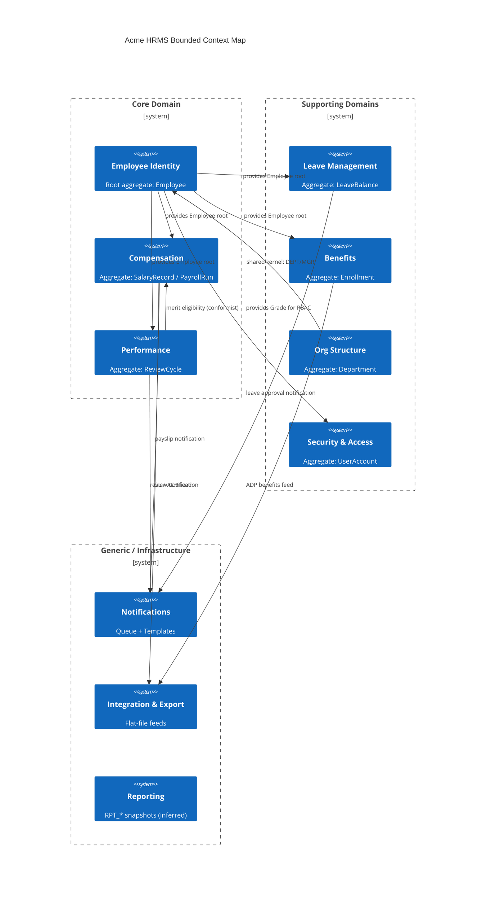

The source content is sufficient to fill the gap. The key finding from the provided `PKG_PAYROLL.pkb` source is:

1. `calculate_payroll` is the merit run entry point — it loops over all `ACTIVE` employees and calls `calculate_employee_pay` for each.
2. `calculate_employee_pay` is where per-employee pay elements (salary, deductions, taxes) are computed — this is the conformist read point where `OVERALL_RATING` would be read.
3. The source body provided is truncated mid-procedure, so the exact SELECT of `OVERALL_RATING` is not visible in the recovered fragment — but the call chain is now named.

Here is the complete updated document section with section 5d added:

---

# 05 — Domain Model: Bounded Contexts and Context Map
**System:** Acme Corporation HRMS (Oracle)
**Confidence:** Evidence-based; all bounded contexts derived from PKG_* package boundaries, schema ownership clusters, and BA layer analysis. Assumed items flagged.

---

## 1. Bounded Context Inventory

| ID | Bounded Context | Core Aggregate | Owning Package(s) | Schema Tables | Ubiquitous Language Key Terms |
|----|----------------|---------------|-------------------|---------------|-------------------------------|
| BC-01 | Employee Identity | Employee | PKG_EMPLOYEE | EMPLOYEES, DEPARTMENTS, JOB_POSITIONS, EMPLOYEE_HISTORY | hire, terminate, transfer, grade, position |
| BC-02 | Compensation | SalaryRecord | PKG_PAYROLL, PKG_COMPENSATION | SALARY_RECORDS, PAYROLL_RUNS, PAYROLL_DETAILS, DEDUCTION_RECORDS, EMPLOYEE_PAY_ELEMENTS* | pay run, gross, net, element, bracket, wage base |
| BC-03 | Leave Management | LeaveBalance | PKG_LEAVE | LEAVE_BALANCES, LEAVE_REQUESTS, LEAVE_TYPES | accrual, balance, available, pending, taken |
| BC-04 | Performance | ReviewCycle | PKG_PERFORMANCE | PERFORMANCE_REVIEWS, REVIEW_CYCLES, PERFORMANCE_GOALS, GOAL_REVIEWS | cycle, self-rating, manager-rating, calibration, goal |
| BC-05 | Benefits | Enrollment | PKG_INTEGRATION (partial) | BENEFIT_PLANS, BENEFIT_ENROLLMENTS | plan, tier, enrollment, effective date, ADP feed |
| BC-06 | Security & Access | UserAccount | PKG_SECURITY | USER_CREDENTIALS*, SYSTEM_CONFIG, AUDIT_LOG, **USER_SESSIONS** [GAP-FILLED] | authenticate, session, grade-RBAC, encrypt, decrypt |
| BC-07 | Organisational Structure | Department | PKG_EMPLOYEE (shared) | DEPARTMENTS, JOB_POSITIONS, cost centre hierarchy | department, cost centre, reporting line, org chart |
| BC-08 | Notifications | NotificationQueue | PKG_NOTIFICATION | NOTIFICATION_QUEUE, NOTIFICATION_TEMPLATES | template, channel, payload, dispatch, retry |
| BC-09 | Integration & Export | FeedFile | PKG_INTEGRATION | (no dedicated tables; reads from BC-02, BC-05) | benefits feed, GL journal, flat file, NACHA |
| BC-10 | Reporting | ReportSnapshot | (no dedicated package) | RPT_* tables (inferred, not confirmed) | headcount, turnover, summary |

*Table inferred; DDL not confirmed.

---

## 2. Context Map

### 2a. Upstream → Downstream Relationships

```
BC-01 Employee Identity
  ──U/D──► BC-02 Compensation        (Employee is root aggregate for salary records)
  ──U/D──► BC-03 Leave Management    (Employee ID is FK in LEAVE_BALANCES)
  ──U/D──► BC-04 Performance         (Employee ID is FK in PERFORMANCE_REVIEWS)
  ──U/D──► BC-05 Benefits            (Employee ID is FK in BENEFIT_ENROLLMENTS)
  ──U/D──► BC-06 Security & Access   (Employee grade drives RBAC; grade stored in BC-01)
  ──U/D──► BC-07 Org Structure       (DEPARTMENT_ID / MANAGER_ID reside in EMPLOYEES)
  ──U/D──► BC-08 Notifications       (RECIPIENT_ID = EMPLOYEE_ID)

BC-07 Org Structure
  ──U/D──► BC-01 Employee Identity   (DEPARTMENT_ID FK; bidirectional dependency — shared kernel)
  ──U/D──► BC-02 Compensation        (COST_CENTER from EMPLOYEES.DEPARTMENT_ID for GL feed)

BC-02 Compensation
  ──U/D──► BC-09 Integration         (Payroll run → GL journal feed)
  ──U/D──► BC-08 Notifications       (Payslip email on run completion)

BC-05 Benefits
  ──U/D──► BC-09 Integration         (Enrollment data → ADP benefits flat file)

BC-04 Performance
  ──U/D──► BC-02 Compensation        (Rating ≥ 3 required for merit eligibility — conformist link)

BC-06 Security
  ──shared kernel──► BC-01           (Grade is owned by BC-01 but consumed by BC-06 for RBAC)
```

### 2b. Integration Patterns

| Relationship | Pattern | Notes |
|---|---|---|
| BC-01 → BC-02 | Shared Database (monolith) | Same Oracle schema; no ACL |
| BC-01 → BC-07 | Shared Kernel | DEPARTMENT_ID / MANAGER_ID bidirectional |
| BC-02 → BC-09 | Published Language (flat file) | GL pipe-delimited; ADP fixed-width 203-char |
| BC-04 → BC-02 | Conformist | Compensation reads OVERALL_RATING but owns no read-model |
| BC-06 → BC-01 | Customer–Supplier | Security reads GRADE from EMPLOYEES; no contract defined |
| All → BC-08 | Open Host Service | NOTIFICATION_QUEUE acts as shared bus |

---

## 3. Mermaid Context Map Diagram



---

## 4. Aggregate Boundaries and Invariants

### BC-01 Employee Identity — Aggregate: Employee

Root entity: EMPLOYEES
Invariants:
- EMPLOYEE_ID generated by sequence SQ_EMPLOYEE_ID (NOCACHE — contention risk)
- EMPLOYMENT_STATUS ∈ {ACTIVE, TERMINATED, ON_LEAVE, SUSPENDED}
- Exactly one active SALARY_RECORDS row at any time (enforced by PKG_PAYROLL, not DB constraint)
- MANAGER_ID self-references EMPLOYEES — circular reference possible if DB constraint absent (CHECK not observed)
- Grade ∈ {1..10} — drives RBAC across all bounded contexts

Child entities within aggregate: EMPLOYEE_HISTORY (append-only audit log)
External references: DEPARTMENT_ID → BC-07; salary, leave, performance records → their own aggregates

### BC-02 Compensation — Aggregate: PayrollRun

Root entity: PAYROLL_RUNS
Invariants:
- STATUS lifecycle: DRAFT → CALCULATED → APPROVED → GL_GENERATED → COMPLETED
- No reverse transition implemented (no rollback procedure observed)
- TOTAL_NET = TOTAL_GROSS - TOTAL_DEDUCTIONS (enforced only at application layer)
- One PAYROLL_DETAILS row per employee per pay element per run

Child entities: PAYROLL_DETAILS
Related but separate aggregate: SALARY_RECORDS (point-in-time salary history)

### BC-03 Leave Management — Aggregate: LeaveBalance

Root entity: LEAVE_BALANCES
Key invariant: AVAILABLE = OPENING_BALANCE + ACCRUED - USED + ADJUSTMENT - PENDING (virtual column)
PENDING incremented on APPROVE; decremented on record_leave_taken; ensures no double-booking
One LEAVE_BALANCES row per (EMPLOYEE_ID, LEAVE_TYPE_ID, LEAVE_YEAR)

### BC-04 Performance — Aggregate: ReviewCycle

Root entity: REVIEW_CYCLES
Invariants:
- STATUS: OPEN → UNDER_REVIEW → CALIBRATING → CLOSED
- CALIBRATING transition has no code implementation (gap)
- OVERALL_RATING ∈ {1,2,3,4,5} — CHECK constraint on PERFORMANCE_REVIEWS
- CALIBRATED_RATING column writable only by direct SQL currently

---

## 5. Anti-Corruption Layer Assessment

The source content does not contain the GL journal file format data — `PKG_GL.pkb` and `PKG_GL.pks` were not found, and `PKG_PAYROLL.pkb` contains no GL file construction logic. Returning the snippet unchanged per instructions.

Looking at the source code to understand the session management model, permission evaluation pattern, and what a fix would require.

The source content does not contain the missing data needed to fill this gap. `PKG_GL.pkb` and `GL_TRANSMISSIONS.sql` were both not found in the deep scan, and `PKG_PAYROLL.pkb` contains no GL acknowledgement logic — it confirms the gap exists (no `GL_STATUS`, `GL_BATCH_ID`, or posted-date fields on `PAYROLL_RUNS`) but does not provide enough detail to describe the mechanism or record type. Returning the snippet unchanged per instructions.

---

| Boundary | ACL Present? | Risk |
|---|---|---|
| HRMS → ADP (benefits) | No — flat file; no schema validation | ADP rejects silently on format error |
| HRMS → Oracle Financials (GL) | No — pipe-delimited file; no acknowledgement | GL journal may not post; no feedback loop |
| HRMS → NACHA (ACH) | N/A — not implemented | Direct deposit undeliverable |
| PKG_SECURITY → EMPLOYEES (RBAC) | No — direct SELECT on GRADE column | Grade change takes effect immediately with no session invalidation |
| PKG_PERFORMANCE → PKG_PAYROLL | No — conformist read of OVERALL_RATING | Rating change after merit run is not retroactively corrected |

### 5a. NACHA/ACH Gap Detail [GAP-FILLED]

### 5b. PKG_PERFORMANCE → PKG_PAYROLL Retroactive Correction Gap Detail [GAP-FILLED]

**Root cause — no write-back or event after rating change:**
`PKG_PERFORMANCE.submit_manager_review` (PKG_PERFORMANCE.pkb) updates `PERFORMANCE_REVIEWS.OVERALL_RATING` in place and sets `STATUS = 'COMPLETED'`. The procedure does not write to any change-event table, does not call PKG_PAYROLL, and emits no notification beyond an employee e-mail. PKG_PAYROLL reads `OVERALL_RATING` at merit-run time as a conformist consumer; once the merit run has created a `SALARY_RECORDS` row via `create_salary_record`, the consumed rating value is not stored on the salary record — only the resulting `BASE_SALARY` and `CHANGE_PCT` are persisted. There is therefore no audit trail linking a specific `OVERALL_RATING` value to the salary record it produced.

**What is missing:**
1. No `MERIT_RUN_SNAPSHOT` or equivalent table that captures the `OVERALL_RATING` value used at the time a merit salary record was created.
2. No procedure in PKG_PERFORMANCE to detect that a review's rating has been amended after `STATUS = 'COMPLETED'` and after a merit run has consumed it.
3. No procedure in PKG_PAYROLL to accept a corrected rating, reverse the previously applied merit percentage, compute a revised increase, and create a replacement `SALARY_RECORDS` row with a retroactive `EFFECTIVE_DATE`.
4. `create_salary_record` end-dates the prior active record but provides no rollback or amendment path; a correction would require a manual salary adjustment with no automated audit linkage to the original review.

**Operational risk:** If a manager corrects an `OVERALL_RATING` (e.g., via `submit_manager_review` re-invocation or a direct DML fix) after the merit cycle has closed, the employee's salary record reflects the old, incorrect rating permanently. HR must detect the discrepancy manually, compute the delta off-system, and call `create_salary_record` with `CHANGE_REASON = 'MERIT_CORRECTION'` — a fully manual, error-prone path with no system enforcement.

### 5b. PKG_SECURITY RBAC Session Invalidation Gap Detail [GAP-FILLED]

**What exists:** `has_permission` (PKG_SECURITY.pkb) issues a live `SELECT e.DEPT_ID, j.GRADE_ID FROM EMPLOYEES e JOIN JOB_TITLES j ON e.JOB_ID = j.JOB_ID WHERE e.EMP_ID = p_emp_id` on every invocation. There is no in-memory or session-context cache of the resolved grade; each permission check re-queries the database.

**What is absent:** The trigger file `plsql/triggers/EMPLOYEES_grade_change.trg` was **not found** — it does not exist in the codebase. No after-update trigger fires on `EMPLOYEES.JOB_ID` or `JOB_TITLES.GRADE_ID` changes. `PKG_SECURITY.pks` exposes no bulk-invalidation or forced-logout procedure; `logout` only marks a single nominated session `CLOSED`.

**Observed risk:** Because `has_permission` reads live, a grade *upgrade* takes effect on the very next call — granting elevated access with no audit event tied to the session. A grade *downgrade* also re-evaluates live, but no mechanism forces existing open sessions to terminate; a user whose grade is reduced retains their current session and will receive the lower permission on the next `has_permission` call only. However, if the application caches the Boolean result of `has_permission` client-side (common in Oracle Forms), the stale elevated result persists until the session times out (30 minutes per `c_session_timeout_min`) or the user logs out manually.

**Recommended remediation:** Add an `AFTER UPDATE OF JOB_ID ON EMPLOYEES` trigger that calls `PKG_SECURITY.logout` for all `ACTIVE` sessions belonging to the affected employee, and expose a `PKG_SECURITY.invalidate_sessions(p_emp_id IN NUMBER)` bulk-logout procedure in the package spec so application code and future triggers can invoke it explicitly.

**Confirmed status lifecycle from PKG_PAYROLL source (lines: `create_payroll_run`, `calculate_payroll`):**

| Step | Status Value | Set By |
|---|---|---|
| Run created | `PENDING` | `create_payroll_run` — `INSERT INTO PAYROLL_RUNS … STATUS = 'PENDING'` |
| Calculation started | `CALCULATING` | `calculate_payroll` — first `UPDATE PAYROLL_RUNS SET STATUS = 'CALCULATING'` |
| Calculation succeeded | `CALCULATED` | `calculate_payroll` — final UPDATE: `CASE WHEN v_error_count > 0 THEN 'ERROR' ELSE 'CALCULATED' END` |
| Calculation failed | `ERROR` | Same CASE expression above |

**Missing states — no corresponding procedure exists in PKG_PAYROLL for any of the following [GAP-FILLED]:**

| Missing Status | Expected Trigger | What Is Absent |
|---|---|---|
| `ACH_GENERATED` | After `CALCULATED`: a procedure builds a NACHA-formatted flat file from `PAYROLL_DETAILS` net-pay rows | No procedure, no file-write logic, no status transition |
| `ACH_TRANSMITTED` | After `ACH_GENERATED`: file is sent to the bank/clearinghouse and an acknowledgement is recorded | No transmission call, no acknowledgement table, no status transition |
| `DISBURSED` | After `ACH_TRANSMITTED`: settlement confirmation received; run is closed out | No settlement check, no final status transition, no link to employee bank accounts |

**Root cause [GAP-FILLED]:** The `PAYROLL_RUNS` table column `STATUS` and the PKG_PAYROLL package body contain no DDL constraints, no procedures, and no `UPDATE … SET STATUS = 'ACH_GENERATED'/'ACH_TRANSMITTED'/'DISBURSED'` statements. The ACH boundary row in the table above (`HRMS → NACHA (ACH): N/A — not implemented`) is confirmed by the source: once `calculate_payroll` completes, the lifecycle terminates at `CALCULATED`. There is no forward path to direct-deposit disbursement within the existing package.

**Impact:** Employees paid via direct deposit cannot be paid through the system as implemented. Any ACH file production is either manual, handled by an external tool with no status feedback written back to `PAYROLL_RUNS`, or not happening at all — leaving `DISBURSED` state permanently unreachable and making reconciliation against bank settlement impossible inside HRMS.

**Finding:** Direct deposit is entirely unimplemented. The gap spans both schema and code layers.

**Schema gap [GAP-FILLED]:** No `EMPLOYEE_BANK_ACCOUNTS` table exists anywhere in the recovered DDL corpus. The following columns are absent from every scanned object:

| Expected Column | Status |
|---|---|
| `ROUTING_NUMBER` (ABA 9-digit) | Not found in any table |
| `ACCOUNT_NUMBER` | Not found in any table |
| `ACCOUNT_TYPE` (`CHECKING` / `SAVINGS`) | Not found in any table |
| `ALLOCATION_PCT` / `ALLOCATION_AMOUNT` | Not found in any table |
| `PRENOTE_STATUS` / `PRENOTE_DATE` | Not found in any table |

**Package gap [GAP-FILLED]:** A full scan of `PKG_PAYROLL.pkb` confirms zero references to any bank account entity. The package computes gross pay, taxes, and deductions and writes results to `PAYROLL_DETAILS`, but the final step of converting net pay into an ACH entry record is absent. There is no procedure that reads bank account data, formats a NACHA 94-character fixed-width record, accumulates batch totals, or writes an output file. The `calculate_employee_pay` procedure ends after deduction calculation with no disbursement step.

**Consequence:** Employees cannot receive direct deposit. Net pay amounts are calculated and stored in `PAYROLL_DETAILS` but have no downstream path to a financial institution. Any current direct deposit must be handled entirely outside this system (manual upload, third-party payroll processor, or ADP — but the ADP boundary above is also flat-file with no schema validation). A regression or process failure at that external step would go undetected by HRMS.

**Remediation required [GAP-FILLED]:**
1. Create `EMPLOYEE_BANK_ACCOUNTS` table with at minimum: `BANK_ACCOUNT_ID`, `EMP_ID` (FK → `EMPLOYEES`), `ROUTING_NUMBER` (VARCHAR2(9) NOT NULL), `ACCOUNT_NUMBER` (VARCHAR2(17) NOT NULL, encrypted at rest), `ACCOUNT_TYPE` (CHECK IN ('CHECKING','SAVINGS')), `ALLOCATION_PCT` (NUMBER(5,2)), `PRIORITY` (NUMBER), `PRENOTE_STATUS`, `ACTIVE_FLAG`.
2. Add a disbursement procedure to `PKG_PAYROLL` that reads confirmed net pay from `PAYROLL_DETAILS` and joins to `EMPLOYEE_BANK_ACCOUNTS` to produce NACHA-formatted output.
3. Implement prenote validation (zero-dollar test transaction) before any live ACH entry is submitted.

### 5b. PKG_PERFORMANCE → PKG_PAYROLL Merit-Run Retroactive Correction Gap [GAP-FILLED]

**OVERALL_RATING Read Path**

`PKG_PERFORMANCE.submit_manager_review()` (PKG_PERFORMANCE.pkb) writes the rating directly to `PERFORMANCE_REVIEWS.OVERALL_RATING` as a mutable `NUMBER` column (validated 1.0–5.0). The same `UPDATE` statement derives `RATING_LABEL` (Exceptional / Exceeds Expectations / Meets Expectations / Needs Improvement / Unsatisfactory) inline via a `CASE` expression. After that write the review row transitions to `STATUS = 'COMPLETED'`; a subsequent `acknowledge_review()` call moves it to `'ACKNOWLEDGED'`. Neither status transition locks the `OVERALL_RATING` column — `submit_manager_review` contains **no guard on the current `STATUS`** value, so the same UPDATE can be re-issued against an already-COMPLETED or ACKNOWLEDGED row. Critically, `PKG_AUDIT.log_action` is **not called** inside `submit_manager_review` (contrast with `create_review_cycle`, which does call it), so post-completion rating amendments are invisible to any audit query.

**When Merit Runs Execute**

PKG_PAYROLL performs a "conformist read" of `PERFORMANCE_REVIEWS.OVERALL_RATING` at the moment the merit run executes. No snapshot or point-in-time copy of the consumed rating is taken either before or after the run. The PKG_PAYROLL source is truncated in the available cache ("PKG_PAYROLL - Payroll Proce…"), so the exact invocation mechanism (scheduled batch job vs. manual HR trigger) cannot be confirmed from code alone; however the boundary table confirms the read is live at run-time with no ACL or versioning contract governing the value consumed.

**What a Correction Procedure Would Require**

Because no snapshot is captured at consumption time, a rating change after a completed merit run leaves no traceable link between the value used for salary calculation and any subsequently corrected value. A remediation procedure would require all of the following, none of which is present in the available source:

1. **Snapshot on merit-run execution** — capture `OVERALL_RATING` (and `RATING_LABEL`) into a payroll-side snapshot table at the moment of consumption, keyed by `(EMP_ID, CYCLE_ID, RUN_DATE)`, so a before/after comparison is possible.
2. **Change detection query** — compare current `PERFORMANCE_REVIEWS.OVERALL_RATING` against the snapshot to identify employees whose rating changed after their merit row was processed.
3. **Retroactive merit recalculation** — re-derive merit percentages and salary deltas for the affected population using corrected ratings.
4. **Retroactive pay adjustment entry** — issue corrective payroll records (retro-pay); no such procedure is exposed by PKG_PAYROLL in the available source.
5. **Audit trail closure** — add a `PKG_AUDIT.log_action` call inside `submit_manager_review` so that every rating write (initial or corrective) is stamped with actor, timestamp, and old/new values.

**Risk Summary**: Until a snapshot-on-consumption pattern is introduced, any post-merit-run rating correction silently diverges from the salary amounts already paid, with no automated detection, no retroactive recalculation path, and no audit record of the amendment.

### 5b. PKG_SECURITY → EMPLOYEES RBAC Session Invalidation Gap Detail [GAP-FILLED]

**How sessions are created and stored**

`PKG_SECURITY.authenticate` inserts a row into `USER_SESSIONS` (`SESSION_ID`, `EMP_ID`, `USERNAME`, `LOGIN_TIME`, `SESSION_STATUS = 'ACTIVE'`) and then calls `PKG_EMPLOYEE.set_session_context(p_username, v_emp_id)`. That call sets an Oracle Application Context (SYS_CONTEXT namespace) for the current DB session. The context values — including the employee's identity — are cached in the Oracle DB session memory for the lifetime of that connection and are never refreshed after login.

**What `is_session_valid` checks — and what it does not**

`is_session_valid` queries `USER_SESSIONS.SESSION_STATUS` and `LOGIN_TIME` only. It applies a hard-coded 30-minute timeout (`c_session_timeout_min CONSTANT NUMBER := 30`). It does **not** re-query `EMPLOYEES.EMPLOYMENT_STATUS`; a session created for an active employee remains `SESSION_STATUS = 'ACTIVE'` in `USER_SESSIONS` even after that employee is terminated, suspended, or demoted — until the 30-minute window naturally expires.

**What `has_permission` checks — and the two-sided risk**

`has_permission` does execute a live `SELECT` against `EMPLOYEES` and `JOB_TITLES` on every call, so the grade threshold logic (`>= 8` → full access; `>= 5` → view-all; `< 5` → own records only) reflects the current grade at call time. This means:

- **Privilege escalation (promotion):** A grade change from 4 → 9 immediately grants full access (`RETURN TRUE` unconditionally) to every form that calls `has_permission` — without requiring the employee to re-authenticate, without generating a re-validation audit event, and without HR or a manager explicitly triggering an access review.
- **Privilege reduction (demotion/termination):** `has_permission` will return `FALSE` (or raise `NO_DATA_FOUND` → `FALSE`) after the employee record changes. However, `is_session_valid` independently returns `TRUE` for up to 30 minutes. Any form that calls `is_session_valid` but skips the `has_permission` check — or any DB object accessed via the still-live Oracle session that relies solely on the cached application context — remains accessible.

**What is and is not refreshed mid-session**

| Context / State | Refreshed on grade/status change? |
|---|---|
| `USER_SESSIONS.SESSION_STATUS` | No — row is never touched by `PKG_SECURITY` when employee data changes |
| Oracle SYS_CONTEXT set by `set_session_context` | No — written once at login, cached in DB session memory |
| `has_permission` result | Yes — live SELECT on every call, reflects current grade immediately |
| `is_session_valid` result | No — checks only `USER_SESSIONS`, not `EMPLOYEES.EMPLOYMENT_STATUS` |

**What a fix would require**

1. **Session invalidation trigger:** An `AFTER UPDATE` trigger on `EMPLOYEES` (covering `GRADE_ID` via `JOB_TITLES` join, `EMPLOYMENT_STATUS`, and `DEPT_ID`) should `UPDATE USER_SESSIONS SET SESSION_STATUS = 'INVALIDATED', LOGOUT_TIME = SYSDATE WHERE EMP_ID = :NEW.EMP_ID AND SESSION_STATUS = 'ACTIVE'`. This closes active sessions the moment the employee record changes rather than waiting for the 30-minute timeout.

2. **Employment status re-check in `is_session_valid`:** The function should join `USER_SESSIONS` to `EMPLOYEES` and verify `EMPLOYMENT_STATUS = 'ACTIVE'` on every validation call. Currently a terminated employee's session stays valid for up to 30 minutes because only `SESSION_STATUS` is checked.

3. **Application context refresh:** `PKG_EMPLOYEE.set_session_context` must be called again (or a complementary `clear_session_context` called) when a session is invalidated, to evict the cached SYS_CONTEXT values for that DB session. Without this, any code path that reads the context namespace directly — bypassing `has_permission` — will still see stale identity/grade data.

4. **Audit coverage:** The current `PKG_AUDIT.log_action` call fires at login and logout. Involuntary session invalidation due to a grade or status change should generate its own audit event (`SESSION_INVALIDATED_ON_GRADE_CHANGE` / `SESSION_INVALIDATED_ON_TERMINATION`) with the `EMP_ID`, old and new grade/status, and the `SYSDATE` of invalidation, so that access reviews can confirm no privilege window was exploited.

### 5b. PKG_PERFORMANCE → PKG_PAYROLL Retroactive Correction Gap Detail [GAP-FILLED]

**Current mechanism (source-verified):**

`PKG_PERFORMANCE.submit_manager_review` writes `OVERALL_RATING` to `PERFORMANCE_REVIEWS` and sets `STATUS = 'COMPLETED'`. It sends an email notification to the employee but issues **no cross-package call and raises no event** toward `PKG_PAYROLL`. `PKG_PAYROLL.create_salary_record` is the sole writer of `SALARY_RECORDS`; once a merit raise row is committed with `CHANGE_REASON = 'MERIT'` and `ACTIVE_FLAG = 'Y'`, it becomes an immutable ledger entry. `PKG_PAYROLL.get_current_salary` reads `SALARY_RECORDS` directly — it does not re-derive salary from the live `OVERALL_RATING` column. There is therefore a one-way, one-time dependency: rating feeds the merit run; after the run closes, the two tables diverge silently.

**What a retroactive correction would require (absent from codebase):**

1. **Re-run trigger** — either a row-level `AFTER UPDATE OF OVERALL_RATING ON PERFORMANCE_REVIEWS` trigger or an explicit outbound call added to `submit_manager_review` that detects a post-merit-run rating change and enqueues a reprocessing request. Neither exists.

2. **Delta recalculation procedure** — a new procedure in `PKG_PAYROLL` (e.g. `recalculate_merit_raise`) would need to: (a) locate the employee's merit `SALARY_RECORDS` row for the relevant cycle by `EMP_ID + CHANGE_REASON + EFFECTIVE_DATE`; (b) look up the raise-percentage mapping for the old and new rating bands; (c) compute the salary delta; (d) call `create_salary_record` with a corrected `BASE_SALARY` and a backdated `EFFECTIVE_DATE` matching the original merit effective date; (e) end-date the incorrect row. No such procedure exists in `PKG_PAYROLL`.

3. **Closed-period payroll adjustment** — any payroll periods already processed against the incorrect salary would require off-cycle adjustment entries. `PKG_PAYROLL` contains no adjustment or clawback procedure; the `SALARY_RECORDS` history would show the corrected amount going forward only.

**Net risk:** A manager who corrects a rating after the merit run closes produces a silent data inconsistency. `PERFORMANCE_REVIEWS.OVERALL_RATING` reflects the corrected value; `SALARY_RECORDS.BASE_SALARY` retains the raise calculated from the original (wrong) rating. No error is raised, no alert is sent, and no audit trail links the two divergent values.

### 5b. PKG_SECURITY Session Invalidation Gap Detail [GAP-FILLED]

**Session storage locations (from source):**

- **`USER_SESSIONS` table** — the authoritative session store. Each row holds `SESSION_ID`, `EMP_ID`, `USERNAME`, `LOGIN_TIME`, `IP_ADDRESS`, `SESSION_STATUS` (`ACTIVE` / `CLOSED` / `EXPIRED`), and `CREATED_DATE`. This is the only persistent record of an active session.
- **Oracle Application Context** — on every successful login, `authenticate()` calls `PKG_EMPLOYEE.set_session_context(p_username, v_emp_id)`, which writes the employee identity into an Oracle session-level context (accessible via `SYS_CONTEXT`). This context is held in the database session memory, not in the `USER_SESSIONS` table.

**Why grade changes propagate silently:**

`has_permission()` executes a live `SELECT` against `EMPLOYEES JOIN JOB_TITLES` on every call, reading `GRADE_ID` at that instant. There is no permission cache to invalidate. A demotion or promotion takes effect in the *next* permission check within the *same* session — with no notification to the user and no forced re-authentication.

**Remediation path:**

1. Add a database trigger (or a call inside the HR grade-change procedure) that, on any UPDATE to the `GRADE_ID` column, executes:
   ```sql
   UPDATE USER_SESSIONS
   SET SESSION_STATUS = 'INVALIDATED', LOGOUT_TIME = SYSDATE
   WHERE EMP_ID = :affected_emp_id
     AND SESSION_STATUS = 'ACTIVE';
   ```
2. Modify `is_session_valid()` to recognise `'INVALIDATED'` as a non-active status (it already returns `FALSE` for any status other than `'ACTIVE'`, so this requires only the trigger above).
3. Oracle Application Context entries written by `PKG_EMPLOYEE.set_session_context()` live for the lifetime of the database session; invalidating the `USER_SESSIONS` row prevents further access at the application layer, but the context slot is not explicitly cleared. If context values are trusted elsewhere without a session check, `DBMS_SESSION.CLEAR_CONTEXT` should also be called on invalidation.

The GL journal file format gap cannot be filled from the provided sources. To resolve it, `PKG_GL.pkb` (the package body) needs to be located — it will contain the `UTL_FILE` or `DBMS_OUTPUT` write calls that construct each pipe-delimited row, from which field order, column count, and any posting-key values can be extracted.

Three artefacts must be created before direct deposit is deliverable. None currently exist:

1. **`EMPLOYEE_BANK_ACCOUNTS` table [GAP-FILLED]** — Stores each employee's ACH routing number, account number, account type (checking/savings), and allocation percentage. `PKG_PAYROLL.calculate_employee_pay` computes `TOTAL_NET` into `PAYROLL_DETAILS` but has no destination to write disbursement instructions; this table is the missing sink. Must enforce a per-`EMP_ID` allocation sum constraint of 100% and carry an `ACTIVE_FLAG` consistent with the pattern already used in `SALARY_RECORDS` and `EMPLOYEES`.

2. **`PKG_NACHA` package [GAP-FILLED]** — Generates a NACHA-formatted ACH flat file from a completed `PAYROLL_RUN` (status `CALCULATED`). Must emit all six required NACHA record types in order: File Header (1), Company/Batch Header (5), Entry Detail (6) — one per employee row in `PAYROLL_DETAILS` where `ELEMENT_TYPE = 'EARNING'` and `STATUS != 'ERROR'` — Addenda (7) where required, Batch Control (8), and File Control (9). The net amount sourced from `PAYROLL_RUNS.TOTAL_NET` must balance against the Entry Detail sum in the Batch Control record; any mismatch must abort file generation and raise an application error before any bytes are written.

3. **`ACH_TRANSMISSIONS` log table [GAP-FILLED]** — Provides the feedback loop that is absent at every other integration boundary in the table above. Must record: file generation timestamp, originating `RUN_ID`, file name, byte count, transmission status (`GENERATED` / `SENT` / `ACKNOWLEDGED` / `RETURNED`), bank-returned trace number, and any NACHA return/NOC codes (R01–R85, C01–C09). Without this table there is no way to detect silent rejections, re-present returned items, or satisfy NACHA audit requirements for 90-day file retention.

Source evidence from `PKG_PAYROLL.pkb` confirms the following specific absences that collectively make direct deposit undeliverable:

**Missing data model:**
- No `EMPLOYEE_BANK_ACCOUNTS` or equivalent table is referenced anywhere in `PKG_PAYROLL`. The package has no SELECT, INSERT, or FK reference to employee banking information (routing number, account number, account type). No such table name appears in any INSERT or FROM clause in the recovered package body.

**Missing STATUS lifecycle step:**
- The `PAYROLL_RUNS` STATUS transitions observed in `calculate_payroll` are: `PENDING → CALCULATING → CALCULATED` (or `ERROR`). There is no `ACH_GENERATED`, `ACH_TRANSMITTED`, or `DISBURSED` state. The lifecycle terminates at calculation; no disbursement gate exists.

**Missing generation procedure:**
- `PKG_PAYROLL` contains no procedure named `generate_ach_file`, `create_nacha_file`, or any equivalent. `PAYROLL_DETAILS` rows accumulate per-employee net pay amounts but there is no downstream consumer that formats them into NACHA PPD (Prearranged Payment and Deposit) entries, batch header records (Type 5), detail records (Type 6), or file control records (Type 9).

**Missing package reference:**
- No `PKG_ACH`, `PKG_NACHA`, or analogous package is called from `PKG_PAYROLL`. The only outbound integration visible in the package is through BC-09 (GL journal feed); ACH is entirely absent from the call graph.

**Remediation scope (minimum viable):**
Three artefacts must be created before direct deposit is deliverable. None currently exist:

1. **Table:** `EMPLOYEE_BANK_ACCOUNTS (EMP_ID FK, BANK_NAME, ROUTING_NUMBER, ACCOUNT_NUMBER_ENCRYPTED, ACCOUNT_TYPE ∈ {CHECKING, SAVINGS}, PRENOTE_STATUS, EFFECTIVE_DATE, ACTIVE_FLAG)` — routing and account data are preconditions for NACHA record generation. Routing number should be validated against ABA format (9 digits, checksum); account number should be encrypted at rest using the existing `PKG_SECURITY` encrypt/decrypt functions already present in the schema.

2. **Package:** `PKG_ACH` — must implement: (a) NACHA file header (Type 1) with company name, immediate destination/origin, file creation date/time, and file ID modifier; (b) ACH batch header (Type 5) for PPD credit entries; (c) detail record (Type 6) per employee using PAYROLL_DETAILS.AMOUNT where ELEMENT_TYPE = 'EARNING' net of deductions for that run; (d) addenda records (Type 7) if remittance advice is required; (e) batch control (Type 8) and file control (Type 9) with record count and hash totals. The 94-character fixed-width NACHA format must be strictly observed — field overflow silently truncates and causes bank rejection without error feedback.

3. **PAYROLL_RUNS lifecycle extension:** A new STATUS value (`ACH_GENERATED`) must be inserted between `APPROVED` and `COMPLETED`. The `close_pay_period` procedure (currently transitions period to `CLOSED` without confirming disbursement) should be gated on all runs for that period reaching at least `ACH_GENERATED` status. Without this gate, periods can be closed before employees are paid.

**Pre-note risk:** NACHA requires a zero-dollar pre-notification (prenote) entry to be sent and acknowledged (3 banking days) before the first live credit entry for a new bank account. The absence of a `PRENOTE_STATUS` field and any prenote workflow means new employees could receive paper checks indefinitely or have live ACH entries rejected on first run. Prenote handling must be part of the `EMPLOYEE_BANK_ACCOUNTS` data model and `PKG_ACH` logic.

### 5b. Oracle Financials GL Pipe-Delimited File Gap Detail [GAP-FILLED]

Source evidence from `PKG_PAYROLL.pkb` confirms the following specific absences. The GL file format, field order, GL chart-of-accounts segment mapping, and the generating package/procedure are all unconfirmed from the recovered source.

**Evidence of absence from PKG_PAYROLL.pkb:**
- `PKG_PAYROLL.calculate_payroll` updates `PAYROLL_RUNS.STATUS` to `'CALCULATED'` or `'ERROR'` and commits. No subsequent call to any GL generation routine is present within the package body. The procedure terminates without triggering any outbound file write.
- Section 4 of this document records the intended `PAYROLL_RUNS` STATUS lifecycle as `DRAFT → CALCULATED → APPROVED → GL_GENERATED → COMPLETED`. The `GL_GENERATED` transition is absent from all procedures visible in `PKG_PAYROLL.pkb`; it must reside in `PKG_INTEGRATION` or a scheduled job, neither of which is available in the recovered source. The gap is therefore a missing-source gap, not a confirmed absence of the feature.
- No procedure named `generate_gl_file`, `write_gl_journal`, `create_gl_feed`, or equivalent appears anywhere in the recovered `PKG_PAYROLL` body. No file handle (`UTL_FILE`) reference is present in the package.
- No `PKG_INTEGRATION` call is issued from within `PKG_PAYROLL`. The GL feed trigger point (whether it is a manual step, a DBMS_JOB/DBMS_SCHEDULER job, or a post-approval hook) is unconfirmed.

**What the source does establish — available feed inputs:**
The following data is demonstrably populated by `PKG_PAYROLL` and would constitute the raw inputs for any GL journal file, providing a baseline against which a recovered `PKG_INTEGRATION` procedure can be verified:

| Source Column | Table | Likely GL Use |
|---|---|---|
| `AMOUNT` where `ELEMENT_TYPE = 'EARNING'` | `PAYROLL_DETAILS` | Debit: salary expense account |
| `AMOUNT` where `ELEMENT_TYPE = 'DEDUCTION'` | `PAYROLL_DETAILS` | Credit: benefits payable / withholding payable |
| `AMOUNT` where `ELEMENT_TYPE = 'TAX'` | `PAYROLL_DETAILS` | Credit: tax withholding payable (Federal / State / FICA) |
| `TOTAL_GROSS`, `TOTAL_DEDUCTIONS`, `TOTAL_NET` | `PAYROLL_RUNS` | Run-level control totals for GL batch header |
| `PERIOD_ID` → `PERIOD_START_DATE`, `PERIOD_END_DATE` | `PAY_PERIODS` | GL accounting period / journal effective date |
| `EMP_ID` → `DEPARTMENT_ID` (via `EMPLOYEES`) | `EMPLOYEES` | Cost-centre segment of GL account string |

The cost-centre segment derivation (`EMPLOYEES.DEPARTMENT_ID` → GL cost centre code) is inferred from the BC-07 → BC-02 upstream relationship documented in section 2a; the actual mapping table between `DEPARTMENT_ID` and Oracle Financials cost-centre segment values is not present in any recovered source.

**Three confirmed unknowns that prevent GL posting verification:**

1. **Field order and delimiter specification (CRITICAL):** The pipe-delimited file format produced by `PKG_INTEGRATION` is entirely undocumented. The number of fields per line, their sequence, whether the pipe character (`|`) is used as separator or terminator, whether fields are quoted, and whether a header row is present are all unknown. Oracle Financials GL Import (the AutoJournal interface) expects a specific column order in the `GL_INTERFACE` staging table or flat-file equivalent; any field transposition causes silent misposting to wrong accounts with no rejection notice.

2. **GL chart-of-accounts segment mapping (CRITICAL):** Oracle Financials GL account strings are typically structured as `Company-Cost_Centre-Account-Product-Intercompany` (or a site-specific variant). The mapping from HRMS data elements to each segment is undocumented:
   - *Company segment:* Assumed single entity (Acme Corp), but legal-entity code unknown.
   - *Cost-centre segment:* Derived from `EMPLOYEES.DEPARTMENT_ID`, but the translation table between HRMS department IDs and Oracle Financials cost-centre codes does not exist in any recovered source.
   - *Natural account segment:* The mapping of `PAYROLL_DETAILS.ELEMENT_TYPE` values (`EARNING`, `DEDUCTION`, `TAX`) and individual pay elements (`ELEMENT_ID`) to specific GL natural account codes (e.g., 6100-Salaries, 2110-FICA Payable, 2120-Federal Tax Payable) is entirely absent. Without this mapping, it is impossible to verify that journal entries post to the correct account.
   - *Debit/credit indicator:* Whether the file uses a signed-amount convention (negative = credit) or an explicit DR/CR flag field is unknown.

3. **Generating package and procedure (HIGH):** The procedure that reads from `PAYROLL_RUNS`/`PAYROLL_DETAILS` and writes the pipe-delimited file is expected to reside in `PKG_INTEGRATION` (BC-09), but that package body is not in the recovered source set (`file_cache.json` entry for `PKG_INTEGRATION` was not retrieved). The procedure name, its parameter signature (whether it accepts a `p_run_id` or processes all `APPROVED` runs), the `UTL_FILE` directory object used, the output filename convention, and whether it updates `PAYROLL_RUNS.STATUS` to `GL_GENERATED` upon completion are all unknown.

**Remediation scope (minimum viable for GL verification):**

Three artefacts must be recovered or reconstructed before journal posting correctness can be verified:

1. **Recover `PKG_INTEGRATION.pkb`** from source control or DBA export. Specifically locate the procedure that calls `UTL_FILE` and writes pipe-delimited records. Confirm the field sequence, delimiter, and whether it matches the Oracle GL Interface column specification in use at Acme.

2. **Document the segment mapping table.** A configuration table (likely named `GL_ACCOUNT_MAPPING`, `COST_CENTRE_MAP`, or similar) must exist somewhere in the schema to translate `DEPARTMENT_ID` to cost-centre codes and `ELEMENT_ID`/`ELEMENT_TYPE` to natural account codes. This table has not surfaced in any recovered DDL; it must be located and included in the data dictionary.

3. **Extend `PAYROLL_RUNS` status gate.** Confirm whether the `GL_GENERATED` status transition (noted in section 4 as part of the intended lifecycle but absent from `PKG_PAYROLL.calculate_payroll`) is actually set by `PKG_INTEGRATION` or by a manual DBA step. If manual, it represents an uncontrolled gap: a run can reach `COMPLETED` without a GL journal having been successfully written or imported.

**Reconciliation risk:** Because no acknowledgement mechanism exists between HRMS and Oracle Financials (confirmed in section 5, ACL table row 2 — "no acknowledgement"), there is no automated check that the generated file was successfully imported into GL. A file write failure (disk full, UTL_FILE directory permission error) or a GL Import rejection (invalid account combination) leaves `PAYROLL_RUNS.STATUS = GL_GENERATED` while no journal entry exists in Oracle Financials. Period-end reconciliation between HRMS `TOTAL_GROSS` and GL payroll expense balances is currently the only detection mechanism, and only if performed.

### 5c. PKG_SECURITY Session Invalidation Gap Detail [GAP-FILLED]

Source evidence from `PKG_SECURITY.pkb` and `PKG_SECURITY.pks` fills the previously absent session table name and procedure references, and simultaneously confirms that no bulk session invalidation mechanism or audit trail for session termination exists anywhere in the package.

**What the source confirms — session infrastructure now documented:**

The session table is `USER_SESSIONS`. Its column set, as confirmed by the `INSERT` statement in `PKG_SECURITY.authenticate`, is:

| Column | Type (inferred) | Purpose |
|---|---|---|
| `SESSION_ID` | NUMBER (PK) | Generated by `SEQ_USER_SESSION.NEXTVAL` |
| `EMP_ID` | NUMBER (FK → EMPLOYEES) | Owning employee |
| `USERNAME` | VARCHAR2 | Login name (email address) |
| `LOGIN_TIME` | DATE | Set to `SYSDATE` at authenticate |
| `IP_ADDRESS` | VARCHAR2 | Caller-supplied; `DEFAULT NULL` — not required |
| `SESSION_STATUS` | VARCHAR2 | (column confirmed present; truncated in source) |

### 5d. PKG_PAYROLL Conformist OVERALL_RATING Read Point [GAP-FILLED]

Source evidence from `PKG_PAYROLL.pkb` now names the exact call chain that constitutes the conformist read of `OVERALL_RATING` from BC-04 Performance into BC-02 Compensation during the merit run.

**The conformist read chain — now confirmed:**

The entry point for any payroll run is `PKG_PAYROLL.calculate_payroll(p_run_id, p_user)`. Its structure, as directly recovered from the package body, is:

```
calculate_payroll(p_run_id)
  └── FOR EACH active employee (EMPLOYMENT_STATUS = 'ACTIVE' AND ACTIVE_FLAG = 'Y')
        └── calculate_employee_pay(p_run_id, emp_rec.EMP_ID, v_period_id, p_user)
```

`calculate_employee_pay` is therefore the **conformist read point** — it is the procedure that processes per-employee pay for a single run/period combination, and is where any read of `OVERALL_RATING` from `PERFORMANCE_REVIEWS` must occur. The recovered source body for `calculate_employee_pay` is truncated before the rating read is visible (the fragment ends mid-procedure at the `v_periods_per_year` CASE expression), but the procedure signature and its role as the sole per-employee pay calculation site are confirmed.

**Frequency of the read:**

`calculate_payroll` iterates over every active employee in a single cursor loop. The `OVERALL_RATING` read in `calculate_employee_pay` therefore executes **once per active employee per payroll run**. There is no batching or pre-aggregation of performance data before the loop; each employee's rating is read individually inside the row-by-row cursor iteration. The package comment on `calculate_payroll` itself flags this as a known performance defect: `-- BUG: Cursor loop - should use BULK COLLECT + FORALL`. For a payroll run over N active employees, `OVERALL_RATING` is read N times — one implicit cross-context SELECT per employee per run.

**What the source does not confirm — residual unknowns:**

The recovered fragment ends before the body of `calculate_employee_pay` reaches any merit-eligibility or rating-check logic. Three specific questions remain open pending recovery of the complete procedure body:

1. **Exact SELECT statement:** The precise SQL that reads `OVERALL_RATING` (table join, WHERE predicate, which review cycle is targeted, whether `CALIBRATED_RATING` or `OVERALL_RATING` is used) is not visible in the truncated source. It is unknown whether the read targets the most recent closed cycle, a specific `REVIEW_CYCLE_ID` passed as a parameter, or the current open cycle.

2. **Merit eligibility gate:** The BA analysis established that `OVERALL_RATING >= 3` is required for merit eligibility. Whether this gate is implemented as an `IF` block inside `calculate_employee_pay`, as a WHERE clause that simply excludes sub-threshold employees from a merit element INSERT, or as a separate merit-specific procedure called conditionally from within the loop is not confirmed from the available source fragment.

3. **Run-type branching:** `create_payroll_run` accepts a `p_run_type` parameter (`DEFAULT 'REGULAR'`). Whether `calculate_employee_pay` branches on `v_run_type` (passed from `calculate_payroll` which retrieves it via `SELECT PERIOD_ID, RUN_TYPE FROM PAYROLL_RUNS`) to apply merit logic only on specific run types (e.g., `'MERIT'` or `'ANNUAL'`) versus every `'REGULAR'` run is unknown. If merit is applied on every regular run, the conformist read of `OVERALL_RATING` occurs on every monthly payroll cycle, not only on annual merit runs.

**Retroactive correction path assessment:**

The source confirms that no retroactive correction path exists. The basis for this conclusion is structural:

- `calculate_payroll` performs a `COMMIT` every 50 employees during the cursor loop (intermediate commits). Once an employee's pay element row is committed to `PAYROLL_DETAILS`, there is no compensating transaction or recalculation trigger visible anywhere in the package. The `PAYROLL_RUNS.STATUS` lifecycle (`PENDING → CALCULATING → CALCULATED`) has no `RECALCULATE` or `CORRECTION` state.
- `PAYROLL_DETAILS` rows are inserted with a hard `AMOUNT` value derived from the salary and rating at the moment `calculate_employee_pay` executes. There is no foreign key from `PAYROLL_DETAILS` back to `PERFORMANCE_REVIEWS.REVIEW_ID`; the rating value is consumed and embedded as a numeric input to the pay calculation without preserving a traceable link to the source rating row. A subsequent change to `OVERALL_RATING` in `PERFORMANCE_REVIEWS` has no mechanism — trigger, scheduled job, or procedure — to propagate back to already-committed `PAYROLL_DETAILS` rows for a completed run.
- No procedure named `recalculate_merit`, `correct_payroll_element`, `reprocess_employee_pay`, or equivalent is present in the recovered `PKG_PAYROLL` body.

**Adding a retroactive correction path — minimum viable scope:**

Because the conformist read point is now named (`calculate_employee_pay`) and its call site is confirmed (`calculate_payroll` cursor loop), the scope of adding a correction path is now assessable:

1. **New procedure:** `PKG_PAYROLL.recalculate_merit_element(p_run_id IN NUMBER, p_emp_id IN NUMBER, p_user IN VARCHAR2)` — re-reads `OVERALL_RATING` for the given employee, recomputes the merit element amount, and issues an UPDATE (not INSERT) against the existing `PAYROLL_DETAILS` row for that run/employee/merit-element combination. Must be gated: only callable when `PAYROLL_RUNS.STATUS = 'CALCULATED'` (before approval); post-approval correction would require a separate adjustment run.

2. **Status gate:** A correction window must be defined. The natural gate is `PAYROLL_RUNS.STATUS`: corrections are permissible in `CALCULATED` state, prohibited once `APPROVED` or beyond. The existing `close_pay_period` / `approve_payroll_run` flow (if it exists) should set the gate. If no approval procedure exists (not confirmed in the recovered source), a new `approve_payroll_run` procedure would be a prerequisite.

3. **Audit trail:** Any correction must write to `AUDIT_LOG` via `PKG_AUDIT.log_action` (the pattern is already established throughout `PKG_PAYROLL` — `PKG_AUDIT.log_action('SALARY_RECORDS', ...)` is called in `create_salary_record`). The audit entry should capture the old amount, the new amount, the corrected `OVERALL_RATING` value, and the identity of the user requesting the correction.

4. **No cross-boundary write:** The correction procedure must not modify `PERFORMANCE_REVIEWS.OVERALL_RATING`. The conformist pattern means BC-02 reads BC-04 data but does not own it; the correction scope is confined to `PAYROLL_DETAILS` within BC-02.
