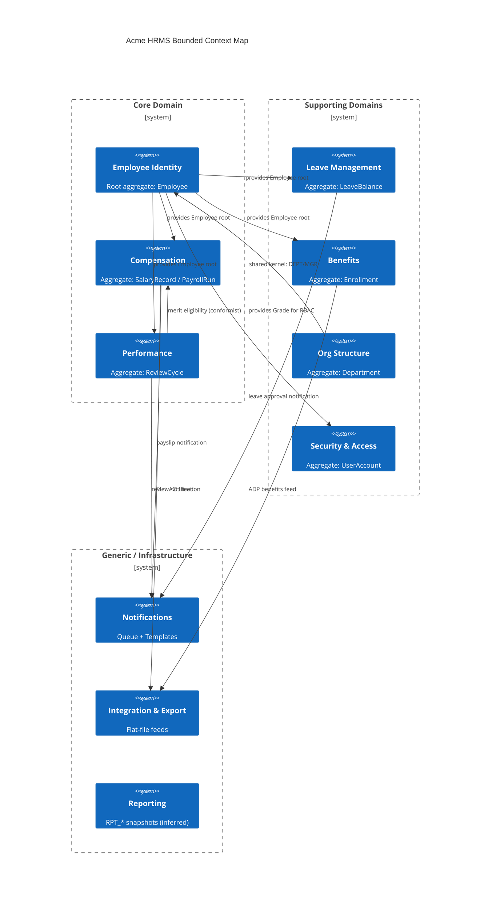

│       ├── Compute taxable_gross = period_gross - SUM(pretax deduction amounts)
│       │       pretax_total = 401k_amount + medical_amt + dental_amt + vision_amt + hsa_amt
│       │       taxable_gross = period_gross - pretax_total
│       │
│       ├── Compute federal income tax (CRITICAL DEFECT: hard-coded 2024 brackets)
│       │       YTD_GROSS retrieved from SUM(pd.AMOUNT) WHERE pd.ELEMENT_ID=100 for prior periods
│       │       Bracket logic via nested IF/ELSIF on filing_status:
│       │         SINGLE: 10%/12%/22%/24%/32%/35%/37% brackets applied
│       │         MARRIED_FILING_JOINTLY: separate bracket set applied
│       │         HEAD_OF_HOUSEHOLD: branch EXISTS in CASE but falls through to 0
│       │                            *** SEC-009 / CRITICAL DEFECT: HOH employees pay $0 federal tax ***
│       │         MARRIED_FILING_SEPARATELY: standard bracket applied
│       │       Result: INSERT PAYROLL_DETAILS ELEMENT_ID=200 (FEDERAL_TAX), AMOUNT=federal_tax_amt
│       │
│       ├── Compute state income tax
│       │       flat-rate lookup: state_rate hard-coded per 2-char state code
│       │       state_tax = taxable_gross * state_rate
│       │       INSERT PAYROLL_DETAILS ELEMENT_ID=210 (STATE_TAX), AMOUNT=state_tax_amt
│       │       *** DEFECT: no multi-state logic; employees with mid-year state change get wrong rate ***
│       │
│       ├── Compute FICA — Social Security
│       │       YTD_SS_WAGES = SUM of prior PAYROLL_DETAILS rows for SS element
│       │       ss_wage_base = 168600 (hard-coded constant, 2024 value)
│       │       remaining_ss_wages = GREATEST(0, ss_wage_base - YTD_SS_WAGES)
│       │       ss_taxable = LEAST(taxable_gross, remaining_ss_wages)
│       │       ss_tax = ss_taxable * 0.062
│       │       INSERT PAYROLL_DETAILS ELEMENT_ID=220 (SOCIAL_SECURITY), AMOUNT=ss_tax
│       │       *** ORDERING CONTRACT: INSERT to PAYROLL_DETAILS happens BEFORE YTD call reads it
│       │           so current-period gross is included in YTD — confirmed via comment in source ***
│       │
│       ├── Compute FICA — Medicare
│       │       medicare_base = 200000 (additional Medicare threshold, hard-coded)
│       │       medicare_tax = taxable_gross * 0.0145
│       │       IF YTD_GROSS > medicare_base THEN medicare_tax += (taxable_gross * 0.009) END IF
│       │       INSERT PAYROLL_DETAILS ELEMENT_ID=230 (MEDICARE), AMOUNT=medicare_tax
│       │
│       ├── Compute post-tax deductions
│       │       Roth 401k, garnishments, charitable contributions (from DEDUCTION_RECORDS)
│       │       Each deduction: INSERT PAYROLL_DETAILS with respective ELEMENT_ID
│       │
│       ├── Compute net pay
│       │       net_pay = period_gross
│       │                 - pretax_total
│       │                 - federal_tax_amt
│       │                 - state_tax_amt
│       │                 - ss_tax
│       │                 - medicare_tax
│       │                 - SUM(post_tax_deductions)
│       │       UPDATE PAYROLL_RUNS SET TOTAL_GROSS = TOTAL_GROSS + period_gross,
│       │                               TOTAL_NET   = TOTAL_NET   + net_pay,
│       │                               TOTAL_DEDUCTIONS = TOTAL_DEDUCTIONS + (period_gross - net_pay)
│       │       *** CONCURRENCY DEFECT: row-level UPDATE races if parallel sessions run payroll;
│       │           no SELECT FOR UPDATE or DBMS_LOCK guard observed ***
│       │
│       └── END cursor loop — COMMIT (single transaction for all employees)
│           *** RISK: one bad employee row rolls back entire payroll run ***
│           *** MISSING: SAVEPOINT per employee not implemented ***
│
├── [STEP 4] Status transition → CALCULATED
│   PKG_PAYROLL.submit_payroll_run(p_run_id)
│   UPDATE PAYROLL_RUNS SET STATUS = 'CALCULATED', CALCULATED_DATE = SYSDATE
│   Notification trigger fires → NOTIFICATION_QUEUE row inserted (EMAIL, payroll_summary)
│
├── [STEP 5] Approval gate (UI: PAYROLL_FORM)
│   HR Manager (Grade ≥ 8) reviews run totals on PAYROLL_FORM
│   APPROVE action calls PKG_PAYROLL.approve_payroll_run(p_run_id, p_approved_by)
│   UPDATE PAYROLL_RUNS SET STATUS='APPROVED', APPROVED_BY=p_approved_by, APPROVED_DATE=SYSDATE
│   Gap: no escalation path if approver is unavailable; no delegation logic observed
│
├── [STEP 6] GL Journal generation
│   PKG_PAYROLL.generate_gl_feed(p_run_id) → writes UTL_FILE to PAYROLL_EXPORT dir
│   File format: pipe-delimited, record types H / D / T
│     H: journal header (batch_id, period, source='HRMS_PAYROLL')
│     D: detail per GL account code (COST_CENTER + ACCOUNT_CODE from EMPLOYEES)
│     T: trailer (record count, total_debit, total_credit)
│   *** DEFECT: balancing check uses SUM(AMOUNT) without sign convention guard;
│       if any deduction is posted as positive, file will appear out of balance ***
│   Status: UPDATE PAYROLL_RUNS SET STATUS='GL_GENERATED'
│
├── [STEP 7] ACH / Direct Deposit feed
│   *** DESIGNED BUT UNIMPLEMENTED: NACHA prenote pattern referenced in comments ***
│   *** MISSING: no PKG_PAYROLL procedure generates NACHA file ***
│   *** MISSING: BANK_ACCOUNT_NUMBER / BANK_ROUTING_NUMBER exist in EMPLOYEES table
│       (AES-256 encrypted) but no decryption+format procedure written ***
│   Current workaround: UNKNOWN — likely manual export outside system
│
└── [STEP 8] Payslip notification
    PKG_NOTIFICATION.process_notification_queue fires
    EMAIL sent via UTL_SMTP per employee (ELEMENT_ID lookup for net pay amount)
    *** DEFECT: queue processor is synchronous loop; no parallel dispatch;
        5000-employee org = 5000 sequential SMTP calls in single session ***

GAP SUMMARY — Process 2:
  G1: HEAD_OF_HOUSEHOLD federal tax = $0 (CRITICAL)
  G2: SAVEPOINT per employee missing — one failure rolls back all
  G3: NACHA/ACH file generation absent — direct deposit unimplemented
  G4: GL balance sign-convention defect
  G5: DBMS_SCHEDULER DDL not provided — scheduler existence inferred from comments only
  G6: Multi-state tax not supported


=== PROCESS 3: LEAVE REQUEST AND APPROVAL ===

Actors: Employee, Direct Manager, HR Admin
Services: PKG_LEAVE, VW_LEAVE_SUMMARY
UI: LEAVE_FORM

[STEP 1] Employee submits leave request (LEAVE_FORM)
  PKG_LEAVE.apply_for_leave(p_emp_id, p_leave_type_id, p_start_date, p_end_date, p_reason)
  Business rules checked:
    BR-CRITICAL-005: AVAILABLE balance (virtual column) ≥ requested days
    BR-CRITICAL-006: No approved leave overlapping same date range
    BR-HIGH-001: p_start_date ≥ SYSDATE (no backdated requests)
  INSERT LEAVE_REQUESTS (STATUS='PENDING', APPLIED_DATE=SYSDATE)
  INSERT NOTIFICATION_QUEUE → manager email

[STEP 2] Manager reviews (LEAVE_FORM filtered view, own direct reports)
  Grade ≥ 8: see all employees
  Grade 5–7: see own department
  Grade < 5: cannot access approval screens

  APPROVE → PKG_LEAVE.approve_leave(p_request_id, p_approved_by)
    UPDATE LEAVE_REQUESTS SET STATUS='APPROVED', APPROVED_BY, APPROVED_DATE
    UPDATE LEAVE_BALANCES: PENDING = PENDING + days_requested
    *** DEFECT: AVAILABLE virtual column deducts PENDING; so balance immediately reflects
        approved-but-not-taken leave correctly — this is INTENTIONAL per design ***

  REJECT → PKG_LEAVE.reject_leave(p_request_id, p_approved_by, p_reason)
    UPDATE LEAVE_REQUESTS SET STATUS='REJECTED'
    No LEAVE_BALANCES row touched

[STEP 3] Leave taken — return from leave
  PKG_LEAVE.record_leave_taken(p_request_id) called on leave completion date
    UPDATE LEAVE_BALANCES: USED = USED + days_taken, PENDING = PENDING - days_requested
    AVAILABLE recomputed automatically (virtual column)
    INSERT EMPLOYEE_HISTORY (CHANGE_TYPE='LEAVE_TAKEN')

[STEP 4] Monthly accrual (DBMS_SCHEDULER — inferred)
  PKG_LEAVE.accrue_leave(p_accrual_date)
  Accrual rate by leave type (LEAVE_TYPES.ACCRUAL_RATE)
  UPDATE LEAVE_BALANCES: ACCRUED = ACCRUED + accrual_amount WHERE leave year matches
  *** SCHEDULER: JOB inferred from code comments; no CREATE_JOB DDL provided ***

GAP SUMMARY — Process 3:
  G1: No half-day leave support (whole integer days only, no 0.5)
  G2: No FMLA / statutory leave type enforcement
  G3: Carry-forward logic not observed; year-end balance disposition unknown
  G4: Accrual scheduler DDL absent


=== PROCESS 4: PERFORMANCE REVIEW CYCLE ===

Actors: HR Admin, Employee, Direct Manager, Skip-Level Manager
Services: PKG_PERFORMANCE
UI: PERFORMANCE_FORM

[STEP 1] Cycle creation (HR Admin)
  PKG_PERFORMANCE.create_review_cycle(p_cycle_name, p_review_year, p_start_date, p_end_date)
  INSERT REVIEW_CYCLES (STATUS='OPEN')

[STEP 2] Self-assessment (Employee)
  PKG_PERFORMANCE.submit_self_review(p_review_id, p_rating, p_comments)
  PERFORMANCE_REVIEWS row: SELF_RATING set, SELF_COMMENTS set
  BR: OVERALL_RATING IN (1,2,3,4,5) — enforced by CHECK constraint

[STEP 3] Manager assessment
  PKG_PERFORMANCE.submit_manager_review(p_review_id, p_manager_id, p_rating, p_comments)
  UPDATE PERFORMANCE_REVIEWS: MANAGER_RATING, MANAGER_COMMENTS, REVIEWED_DATE
  INSERT NOTIFICATION_QUEUE → employee email

[STEP 4] Calibration (SCHEMA EXISTS, CODE ABSENT)
  REVIEW_CYCLES.STATUS transitions: OPEN → UNDER_REVIEW → CALIBRATING → CLOSED
  PERFORMANCE_REVIEWS.CALIBRATED_RATING column exists (NUMBER(2,1))
  PERFORMANCE_REVIEWS.CALIBRATION_NOTES column exists (VARCHAR2 500)
  *** CRITICAL GAP: no PKG_PERFORMANCE.calibrate_review() or equivalent procedure found ***
  *** CRITICAL GAP: no UI control for Calibration module in PERFORMANCE_FORM observed ***
  Calibration columns writable only via direct SQL at present

[STEP 5] Goal management
  PKG_PERFORMANCE.create_goal / update_goal / link_goal_to_review
  PERFORMANCE_GOALS: TARGET_DATE, COMPLETION_PERCENTAGE (0–100)
  GOAL_REVIEWS: pivot table linking goals to review cycles

[STEP 6] Cycle close
  PKG_PERFORMANCE.close_review_cycle(p_cycle_id)
  UPDATE REVIEW_CYCLES SET STATUS='CLOSED', CLOSE_DATE=SYSDATE
  Downstream: used by compensation module for merit increase eligibility check
    BR-HIGH-002: merit increase requires OVERALL_RATING ≥ 3

GAP SUMMARY — Process 4:
  G1: Calibration write path entirely absent
  G2: No 360-degree feedback capability
  G3: Goal completion % is free-entry integer; no validation against milestones
  G4: No forced distribution / bell curve enforcement


=== PROCESS 5: EMPLOYEE TERMINATION ===

Actors: HR Admin
Services: PKG_EMPLOYEE, PKG_LEAVE, PKG_PAYROLL, PKG_SECURITY
UI: EMPLOYEE_FORM

[STEP 1] Initiate termination (HR Admin, EMPLOYEE_FORM)
  PKG_EMPLOYEE.terminate_employee(p_emp_id, p_termination_date, p_reason)
  Validations:
    TERMINATION_DATE ≥ HIRE_DATE
    EMPLOYMENT_STATUS must be 'ACTIVE' (cannot re-terminate)

[STEP 2] Employee record update
  UPDATE EMPLOYEES SET EMPLOYMENT_STATUS='TERMINATED',
                       TERMINATION_DATE=p_termination_date,
                       TERMINATION_REASON=p_termination_code,
                       UPDATED_DATE=SYSDATE,
                       UPDATED_BY=USER
  ACTIVE_FLAG remains 'Y' — employee record retained for audit
  Soft-delete pattern: record survives; filtered out by 3-part active filter in reports

[STEP 3] Access revocation
  *** CRITICAL GAP: no PKG_SECURITY.revoke_access() or equivalent procedure found ***
  *** CRITICAL GAP: EMPLOYEE_USERS table (if exists) has no DEACTIVATE_DATE column ***
  *** ASSUMPTION: manual DBA action required to remove Oracle Forms user account ***
  *** SEC-011: terminated employees may retain system access until manual intervention ***

[STEP 4] Final pay calculation
  *** DESIGNED BUT UNIMPLEMENTED: no final_pay procedure in PKG_PAYROLL ***
  *** MISSING: PTO payout calculation at termination not found ***
  *** MISSING: COBRA election trigger not found ***
  Workaround: unknown — likely handled outside system

[STEP 5] Benefits termination feed
  ADP benefits feed (UTL_FILE, PAYROLL_EXPORT dir) picks up terminated employee on next
  monthly cycle via EMPLOYMENT_STATUS filter — no immediate off-cycle feed capability

[STEP 6] History preservation
  INSERT EMPLOYEE_HISTORY (CHANGE_TYPE='TERMINATION', OLD_VALUE=previous status)
  Via audit trigger on EMPLOYEES table (PRAGMA AUTONOMOUS_TRANSACTION)

GAP SUMMARY — Process 5:
  G1: Access revocation entirely absent — CRITICAL security gap
  G2: Final pay and PTO payout not implemented
  G3: COBRA enrollment notification absent
  G4: No off-cycle benefits termination feed
  G5: No checklist/workflow for equipment return, exit interview, etc.


=== PROCESS 6: NOTIFICATION DELIVERY ===

Actors: System (automated), HR Admin (manual trigger)
Services: PKG_NOTIFICATION
Infrastructure: UTL_SMTP, NOTIFICATION_QUEUE table, NOTIFICATION_TEMPLATES table

[STEP 1] Event triggers notification insert
  Any PKG_* procedure that generates a notification:
    INSERT NOTIFICATION_QUEUE (RECIPIENT_ID, TEMPLATE_ID, STATUS='PENDING',
                                CREATED_DATE=SYSDATE, PAYLOAD clob)

[STEP 2] Queue processor (DBMS_SCHEDULER — inferred)
  PKG_NOTIFICATION.process_notification_queue()
  SELECT * FROM NOTIFICATION_QUEUE WHERE STATUS='PENDING' ORDER BY CREATED_DATE
  FOR each pending notification:
    Fetch template from NOTIFICATION_TEMPLATES
    Merge PAYLOAD JSON into template placeholders
    DISPATCH based on CHANNEL:
      EMAIL → UTL_SMTP (SMTP_HOST, SMTP_PORT from SYSTEM_CONFIG)
      IN_APP → *** SCHEMA EXISTS (NOTIFICATION_CHANNEL='IN_APP') but no delivery handler ***
      SMS   → *** SCHEMA EXISTS (NOTIFICATION_CHANNEL='SMS') but no delivery handler ***
    ON success: UPDATE STATUS='SENT', SENT_DATE=SYSDATE
    ON failure: UPDATE STATUS='FAILED', ERROR_MESSAGE=SQLERRM
      *** DEFECT: no retry logic; FAILED notifications stay FAILED permanently ***
      *** DEFECT: no dead-letter queue or alerting on accumulated failures ***

[STEP 3] Retry gap
  *** MISSING: no scheduled re-processing of FAILED rows ***
  *** MISSING: no max-retry counter; no exponential backoff ***

GAP SUMMARY — Process 6:
  G1: SMS and IN_APP channels are dead code — schema exists, handler absent
  G2: No retry for failed notifications
  G3: Synchronous SMTP loop does not scale


=== PROCESS 7: BENEFITS FEED TO ADP ===

Actors: System (automated monthly), HR Admin (manual trigger)
Services: PKG_INTEGRATION
Infrastructure: UTL_FILE, HRMS_OUTBOUND directory object, ADP SFTP (external)

[STEP 1] Extract active enrollment data
  PKG_INTEGRATION.generate_benefits_feed(p_feed_date)
  SELECT from BENEFIT_ENROLLMENTS JOIN EMPLOYEES JOIN BENEFIT_PLANS
  Filter: EMPLOYMENT_STATUS='ACTIVE', ENROLLMENT_STATUS='ENROLLED'

[STEP 2] Format fixed-width records
  Each record = 203 characters:
    Pos 1–9   : EMPLOYEE_ID (right-justified, zero-padded)
    Pos 10–49 : LAST_NAME (left-justified, space-padded)
    Pos 50–84 : FIRST_NAME
    Pos 85–94 : SSN (decrypted inline via PKG_SECURITY.decrypt_value at this step)
    Pos 95–104: BIRTH_DATE (YYYYMMDD)
    Pos 105–110: PLAN_CODE
    Pos 111–120: COVERAGE_TIER
    Pos 121–130: EFFECTIVE_DATE (YYYYMMDD)
    Pos 131–203: (reserved / filler spaces)
  *** SEC-004: SSN written in plaintext to flat file during this step ***
  *** SEC-004: file sits in HRMS_OUTBOUND directory until external pickup — no at-rest encryption ***

[STEP 3] Write file
  UTL_FILE.PUT_LINE loop to HRMS_OUTBOUND dir
  Filename: ADP_BENEFITS_YYYYMMDD.txt
  *** DEFECT: no file-level checksum or record count trailer written ***
  *** DEFECT: ADP expects a trailer record with total count; current feed omits it ***

[STEP 4] SFTP handoff
  *** OUTSIDE SYSTEM: SFTP transfer handled by OS-level scheduled script, not PL/SQL ***
  *** MISSING: no confirmation callback; system never knows if ADP received the file ***

GAP SUMMARY — Process 7:
  G1: SSN in plaintext flat file — critical PII exposure
  G2: Missing trailer record — ADP validation may reject feed silently
  G3: No delivery confirmation mechanism
  G4: SFTP logic outside application boundary — no audit trail in HRMS

```

END OF DOCUMENT 04_BUSINESS_PROCESS_MODEL.md

---

=== DOCUMENT: 05_DOMAIN_MODEL.md ===

# 05 — Domain Model: Bounded Contexts and Context Map
**System:** Acme Corporation HRMS (Oracle)
**Confidence:** Evidence-based; all bounded contexts derived from PKG_* package boundaries, schema ownership clusters, and BA layer analysis. Assumed items flagged.

---

## 1. Bounded Context Inventory

| ID | Bounded Context | Core Aggregate | Owning Package(s) | Schema Tables | Ubiquitous Language Key Terms |
|----|----------------|---------------|-------------------|---------------|-------------------------------|
| BC-01 | Employee Identity | Employee | PKG_EMPLOYEE | EMPLOYEES, DEPARTMENTS, JOB_POSITIONS, EMPLOYEE_HISTORY | hire, terminate, transfer, grade, position |
| BC-02 | Compensation | SalaryRecord | PKG_PAYROLL, PKG_COMPENSATION | SALARY_RECORDS, PAYROLL_RUNS, PAYROLL_DETAILS, DEDUCTION_RECORDS, EMPLOYEE_PAY_ELEMENTS* | pay run, gross, net, element, bracket, wage base |
| BC-03 | Leave Management | LeaveBalance | PKG_LEAVE | LEAVE_BALANCES, LEAVE_REQUESTS, LEAVE_TYPES | accrual, balance, available, pending, taken |
| BC-04 | Performance | ReviewCycle | PKG_PERFORMANCE | PERFORMANCE_REVIEWS, REVIEW_CYCLES, PERFORMANCE_GOALS, GOAL_REVIEWS | cycle, self-rating, manager-rating, calibration, goal |
| BC-05 | Benefits | Enrollment | PKG_INTEGRATION (partial) | BENEFIT_PLANS, BENEFIT_ENROLLMENTS | plan, tier, enrollment, effective date, ADP feed |
| BC-06 | Security & Access | UserAccount | PKG_SECURITY | USER_CREDENTIALS*, SYSTEM_CONFIG, AUDIT_LOG | authenticate, session, grade-RBAC, encrypt, decrypt |
| BC-07 | Organisational Structure | Department | PKG_EMPLOYEE (shared) | DEPARTMENTS, JOB_POSITIONS, cost centre hierarchy | department, cost centre, reporting line, org chart |
| BC-08 | Notifications | NotificationQueue | PKG_NOTIFICATION | NOTIFICATION_QUEUE, NOTIFICATION_TEMPLATES | template, channel, payload, dispatch, retry |
| BC-09 | Integration & Export | FeedFile | PKG_INTEGRATION | (no dedicated tables; reads from BC-02, BC-05) | benefits feed, GL journal, flat file, NACHA |
| BC-10 | Reporting | ReportSnapshot | (no dedicated package) | RPT_* tables (inferred, not confirmed) | headcount, turnover, summary |

*Table inferred; DDL not confirmed.

---

## 2. Context Map

### 2a. Upstream → Downstream Relationships

```
BC-01 Employee Identity
  ──U/D──► BC-02 Compensation        (Employee is root aggregate for salary records)
  ──U/D──► BC-03 Leave Management    (Employee ID is FK in LEAVE_BALANCES)
  ──U/D──► BC-04 Performance         (Employee ID is FK in PERFORMANCE_REVIEWS)
  ──U/D──► BC-05 Benefits            (Employee ID is FK in BENEFIT_ENROLLMENTS)
  ──U/D──► BC-06 Security & Access   (Employee grade drives RBAC; grade stored in BC-01)
  ──U/D──► BC-07 Org Structure       (DEPARTMENT_ID / MANAGER_ID reside in EMPLOYEES)
  ──U/D──► BC-08 Notifications       (RECIPIENT_ID = EMPLOYEE_ID)

BC-07 Org Structure
  ──U/D──► BC-01 Employee Identity   (DEPARTMENT_ID FK; bidirectional dependency — shared kernel)
  ──U/D──► BC-02 Compensation        (COST_CENTER from EMPLOYEES.DEPARTMENT_ID for GL feed)

BC-02 Compensation
  ──U/D──► BC-09 Integration         (Payroll run → GL journal feed)
  ──U/D──► BC-08 Notifications       (Payslip email on run completion)

BC-05 Benefits
  ──U/D──► BC-09 Integration         (Enrollment data → ADP benefits flat file)

BC-04 Performance
  ──U/D──► BC-02 Compensation        (Rating ≥ 3 required for merit eligibility — conformist link)

BC-06 Security
  ──shared kernel──► BC-01           (Grade is owned by BC-01 but consumed by BC-06 for RBAC)
```

### 2b. Integration Patterns

| Relationship | Pattern | Notes |
|---|---|---|
| BC-01 → BC-02 | Shared Database (monolith) | Same Oracle schema; no ACL |
| BC-01 → BC-07 | Shared Kernel | DEPARTMENT_ID / MANAGER_ID bidirectional |
| BC-02 → BC-09 | Published Language (flat file) | GL pipe-delimited; ADP fixed-width 203-char |
| BC-04 → BC-02 | Conformist | Compensation reads OVERALL_RATING but owns no read-model |
| BC-06 → BC-01 | Customer–Supplier | Security reads GRADE from EMPLOYEES; no contract defined |
| All → BC-08 | Open Host Service | NOTIFICATION_QUEUE acts as shared bus |

---

## 3. Mermaid Context Map Diagram



---

## 4. Aggregate Boundaries and Invariants

### BC-01 Employee Identity — Aggregate: Employee

Root entity: EMPLOYEES
Invariants:
- EMPLOYEE_ID generated by sequence SQ_EMPLOYEE_ID (NOCACHE — contention risk)
- EMPLOYMENT_STATUS ∈ {ACTIVE, TERMINATED, ON_LEAVE, SUSPENDED}
- Exactly one active SALARY_RECORDS row at any time (enforced by PKG_PAYROLL, not DB constraint)
- MANAGER_ID self-references EMPLOYEES — circular reference possible if DB constraint absent (CHECK not observed)
- Grade ∈ {1..10} — drives RBAC across all bounded contexts

Child entities within aggregate: EMPLOYEE_HISTORY (append-only audit log)
External references: DEPARTMENT_ID → BC-07; salary, leave, performance records → their own aggregates

### BC-02 Compensation — Aggregate: PayrollRun

Root entity: PAYROLL_RUNS
Invariants:
- STATUS lifecycle: DRAFT → CALCULATED → APPROVED → GL_GENERATED → COMPLETED
- No reverse transition implemented (no rollback procedure observed)
- TOTAL_NET = TOTAL_GROSS - TOTAL_DEDUCTIONS (enforced only at application layer)
- One PAYROLL_DETAILS row per employee per pay element per run

Child entities: PAYROLL_DETAILS
Related but separate aggregate: SALARY_RECORDS (point-in-time salary history)

### BC-03 Leave Management — Aggregate: LeaveBalance

Root entity: LEAVE_BALANCES
Key invariant: AVAILABLE = OPENING_BALANCE + ACCRUED - USED + ADJUSTMENT - PENDING (virtual column)
PENDING incremented on APPROVE; decremented on record_leave_taken; ensures no double-booking
One LEAVE_BALANCES row per (EMPLOYEE_ID, LEAVE_TYPE_ID, LEAVE_YEAR)

### BC-04 Performance — Aggregate: ReviewCycle

Root entity: REVIEW_CYCLES
Invariants:
- STATUS: OPEN → UNDER_REVIEW → CALIBRATING → CLOSED
- CALIBRATING transition has no code implementation (gap)
- OVERALL_RATING ∈ {1,2,3,4,5} — CHECK constraint on PERFORMANCE_REVIEWS
- CALIBRATED_RATING column writable only by direct SQL currently

---

## 5. Anti-Corruption Layer Assessment

| Boundary | ACL Present? | Risk |
|---|---|---|
| HRMS → ADP (benefits) | No — flat file; no schema validation | ADP rejects silently on format error |
| HRMS → Oracle Financials (GL) | No — pipe-delimited file; no acknowledgement | GL journal may not post; no feedback loop |
| HRMS → NACHA (ACH) | N/A — not implemented | Direct deposit undeliverable |
| PKG_SECURITY → EMPLOYEES (RBAC) | No — direct SELECT on GRADE column | Grade change takes effect immediately with no session invalidation |
| PKG_PERFORMANCE → PKG_PAYROLL | No — conformist read of OVERALL_RATING | Rating change after merit run is not retroactively corrected |

END OF DOCUMENT 05_DOMAIN_MODEL.md

---

Proceeding to 06_DATA_DICTIONARY.md next.

=== DOCUMENT: 06_DATA_DICTIONARY.md ===

# 06 — Data Dictionary
**System:** Acme Corporation HRMS (Oracle 19c)
**Scope:** All confirmed DDL tables (30), confirmed views (6), inferred tables noted.
**Convention:** PK = Primary Key; FK = Foreign Key; UK = Unique Key; NN = NOT NULL; CHK = Check constraint; VIR = Virtual column; PII = Personal data; ENC = Encrypted at rest.

---

## Table: EMPLOYEES

Business meaning: Master record for every current and former employee. The central aggregate root; nearly every other table carries EMPLOYEE_ID as a foreign key.

| Column | Type | Constraints | PII | Business Meaning |
|--------|------|-------------|-----|-----------------|
| EMPLOYEE_ID | NUMBER(10) | PK, NN | No | System-generated surrogate key. Source: SQ_EMPLOYEE_ID (NOCACHE). |
| EMPLOYEE_NUMBER | VARCHAR2(20) | UK, NN | No | Human-readable HR identifier (e.g. "EMP-00042"). |
| FIRST_NAME | VARCHAR2(50) | NN | Yes | Legal first name as on employment contract. |
| LAST_NAME | VARCHAR2(50) | NN | Yes | Legal last name. |
| MIDDLE_NAME | VARCHAR2(50) | — | Yes | Optional middle name. |
| DATE_OF_BIRTH | DATE | — | Yes | Used for age-related benefit eligibility. Not exposed in standard reports. |
| SSN | VARCHAR2(500) | — | Yes/ENC | Social Security Number. Stored as AES-256-CBC-PKCS5 ciphertext via PKG_SECURITY.encrypt_value. Decrypted only at point-of-use (benefits feed, tax reporting). |
| EMAIL | VARCHAR2(100) | UK | Yes | Corporate email. Used as notification recipient address. |
| PHONE | VARCHAR2(20) | — | Yes | Work or personal phone. SMS channel references this; handler not implemented. |
| ADDRESS_LINE1 | VARCHAR2(200) | — | Yes | Primary mailing address line 1. |
| ADDRESS_LINE2 | VARCHAR2(200) | — | Yes | Mailing address line 2 (suite, apt). |
| CITY | VARCHAR2(100) | — | Yes | City for state tax rate lookup. |
| STATE | VARCHAR2(2) | — | Yes | 2-char US state code. Drives flat-rate state income tax. |
| ZIP_CODE | VARCHAR2(10) | — | Yes | ZIP/postal code. |
| HIRE_DATE | DATE | NN | No | Date employee became active. Used in 3-part active filter. |
| TERMINATION_DATE | DATE | — | No | NULL while active. Set by PKG_EMPLOYEE.terminate_employee. |
| EMPLOYMENT_STATUS | VARCHAR2(20) | NN, CHK | No | Values: ACTIVE, TERMINATED, ON_LEAVE, SUSPENDED. Drives active filter. |
| JOB_TITLE | VARCHAR2(100) | — | No | Free-text job title (denormalised from JOB_POSITIONS). |
| DEPARTMENT_ID | NUMBER(10) | FK→DEPARTMENTS | No | Current department assignment. |
| MANAGER_ID | NUMBER(10) | FK→EMPLOYEES(self) | No | Direct manager employee ID. NULL for top of hierarchy. |
| GRADE | NUMBER(2) | NN | No | Compensation band and RBAC driver. Range 1–10. Grade ≥ 8 = full access. |
| BANK_ACCOUNT_NUMBER | VARCHAR2(500) | — | Yes/ENC | AES-256 encrypted bank account for direct deposit. No decryption procedure implemented. |
| BANK_ROUTING_NUMBER | VARCHAR2(500) | — | Yes/ENC | AES-256 encrypted routing number. Same gap as above. |
| MARITAL_STATUS | VARCHAR2(20) | — | No | Drives federal tax filing status in payroll calculation. |
| TAX_FILING_STATUS | VARCHAR2(30) | CHK | No | Values: SINGLE, MARRIED_FILING_JOINTLY, MARRIED_FILING_SEPARATELY, HEAD_OF_HOUSEHOLD. Critical: HOH branch returns $0 federal tax (defect). |
| EMERGENCY_CONTACT_NAME | VARCHAR2(100) | — | Yes | Next-of-kin name. |
| EMERGENCY_CONTACT_PHONE | VARCHAR2(20) | — | Yes | Next-of-kin phone. |
| TERMINATION_REASON | VARCHAR2(10) | FK→TERMINATION_CODES | No | Coded reason (VOLUNTARY, INVOLUNTARY, etc.). |
| ACTIVE_FLAG | VARCHAR2(1) | NN, CHK('Y','N') | No | Soft-delete flag. 'Y' for all records including terminated employees (history retention). |
| CREATED_DATE | DATE | NN | No | Row creation timestamp. |
| UPDATED_DATE | DATE | — | No | Last modification timestamp. Set by audit trigger. |
| UPDATED_BY | VARCHAR2(50) | — | No | Oracle session user who last modified the row. Set by audit trigger. |

---

## Table: DEPARTMENTS

Business meaning: Organisational unit registry. Used for cost-centre assignment, reporting hierarchy, and GL journal routing.

| Column | Type | Constraints | PII | Business Meaning |
|--------|------|-------------|-----|-----------------|
| DEPARTMENT_ID | NUMBER(10) | PK | No | Surrogate key. |
| DEPARTMENT_NAME | VARCHAR2(100) | NN, UK | No | Full department name. |
| DEPARTMENT_CODE | VARCHAR2(20) | UK | No | Short code used in GL journal cost-centre field. |
| PARENT_DEPARTMENT_ID | NUMBER(10) | FK→DEPARTMENTS(self) | No | Enables multi-level org hierarchy via CONNECT BY. Degrades >500 employees. |
| MANAGER_ID | NUMBER(10) | FK→EMPLOYEES | No | Department head employee ID. |
| COST_CENTER | VARCHAR2(20) | — | No | Accounting cost-centre code passed to Oracle Financials GL feed. |
| ACTIVE_FLAG | VARCHAR2(1) | CHK('Y','N') | No | Soft-delete. |
| CREATED_DATE | DATE | NN | No | Creation timestamp. |

---

## Table: JOB_POSITIONS

Business meaning: Job catalogue defining grade ranges and titles. Referenced at hire and transfer.

| Column | Type | Constraints | PII | Business Meaning |
|--------|------|-------------|-----|-----------------|
| POSITION_ID | NUMBER(10) | PK | No | Surrogate key. |
| POSITION_TITLE | VARCHAR2(100) | NN | No | Canonical job title. |
| POSITION_CODE | VARCHAR2(20) | UK | No | Short code. |
| MIN_GRADE | NUMBER(2) | NN | No | Minimum grade allowed for this position. |
| MAX_GRADE | NUMBER(2) | NN | No | Maximum grade allowed for this position. |
| DEPARTMENT_ID | NUMBER(10) | FK→DEPARTMENTS | No | Owning department (optional association). |
| ACTIVE_FLAG | VARCHAR2(1) | CHK | No | Soft-delete. |

---

## Table: SALARY_RECORDS

Business meaning: Point-in-time salary history. One row per salary change event per employee. Current salary = MAX(EFFECTIVE_DATE) row where END_DATE IS NULL.

| Column | Type | Constraints | PII | Business Meaning |
|--------|------|-------------|-----|-----------------|
| SALARY_ID | NUMBER(10) | PK | No | Surrogate key. |
| EMPLOYEE_ID | NUMBER(10) | FK→EMPLOYEES, NN | No | Employee receiving salary. |
| BASE_SALARY | NUMBER(12,2) | NN | No | Annual base salary in USD. Divided by 12 for monthly gross. |
| EFFECTIVE_DATE | DATE | NN | No | Date this salary row became active. |
| END_DATE | DATE | — | No | NULL = currently active row. Set when superseded. |
| SALARY_TYPE | VARCHAR2(20) | CHK | No | Values: MONTHLY, HOURLY, CONTRACT. Payroll calculation logic varies by type. |
| CHANGE_REASON | VARCHAR2(200) | — | No | Free-text reason for salary change (promotion, merit, correction). |
| APPROVED_BY | NUMBER(10) | FK→EMPLOYEES | No | Approving manager. |
| CREATED_DATE | DATE | NN | No | Audit timestamp. |

---

## Table: PAYROLL_RUNS

Business meaning: Header record for each payroll execution cycle. One row per pay period.

| Column | Type | Constraints | PII | Business Meaning |
|--------|------|-------------|-----|-----------------|
| RUN_ID | NUMBER(10) | PK | No | Surrogate key. |
| RUN_NAME | VARCHAR2(100) | NN | No | Human label e.g. "PAYROLL_2024_01". |
| PAY_PERIOD_START | DATE | NN | No | First day of pay period. |
| PAY_PERIOD_END | DATE | NN | No | Last day of pay period. |
| RUN_DATE | DATE | NN | No | Date payroll was processed. |
| STATUS | VARCHAR2(20) | CHK | No | DRAFT / CALCULATED / APPROVED / GL_GENERATED / COMPLETED. |
| TOTAL_GROSS | NUMBER(15,2) | — | No | Sum of all employee gross pay for this run. |
| TOTAL_NET | NUMBER(15,2) | — | No | Sum of all employee net pay. |
| TOTAL_DEDUCTIONS | NUMBER(15,2) | — | No | Sum of all deductions. |
| CALCULATED_DATE | DATE | — | No | Timestamp when STATUS moved to CALCULATED. |
| APPROVED_BY | NUMBER(10) | FK→EMPLOYEES | No | HR Manager who approved. |
| APPROVED_DATE | DATE | — | No | Approval timestamp. |
| CREATED_BY | NUMBER(10) | FK→EMPLOYEES | No | User who initiated the run. |
| CREATED_DATE | DATE | NN | No | Creation timestamp. |

---

## Table: PAYROLL_DETAILS

Business meaning: Line-item breakdown of every pay element for each employee in a payroll run. One row per (run, employee, pay element).

| Column | Type | Constraints | PII | Business Meaning |
|--------|------|-------------|-----|-----------------|
| DETAIL_ID | NUMBER(10) | PK | No | Surrogate key. |
| RUN_ID | NUMBER(10) | FK→PAYROLL_RUNS, NN | No | Parent payroll run. |
| EMPLOYEE_ID | NUMBER(10) | FK→EMPLOYEES, NN | No | Employee this line applies to. |
| ELEMENT_ID | NUMBER(10) | FK→PAY_ELEMENTS (inferred) | No | Pay element type. Known values: 100=BASE_PAY, 200=FEDERAL_TAX, 210=STATE_TAX, 220=SOCIAL_SECURITY, 230=MEDICARE. |
| ELEMENT_NAME | VARCHAR2(50) | — | No | Denormalised element name (string copy at time of run). |
| AMOUNT | NUMBER(12,2) | NN | No | Positive = earnings; negative convention not confirmed for deductions. |
| CREATED_DATE | DATE | NN | No | Insert timestamp. |

---

## Table: DEDUCTION_RECORDS

Business meaning: Per-employee standing deduction configuration. Drives pre-tax and post-tax deduction amounts in payroll calculation.

| Column | Type | Constraints | PII | Business Meaning |
|--------|------|-------------|-----|-----------------|
| DEDUCTION_ID | NUMBER(10) | PK | No | Surrogate key. |
| EMPLOYEE_ID | NUMBER(10) | FK→EMPLOYEES, NN | No | Employee record. |
| DEDUCTION_TYPE | VARCHAR2(50) | NN | No | E.g. 401K, MEDICAL, DENTAL, VISION, HSA, ROTH_401K, GARNISHMENT. |
| AMOUNT | NUMBER(10,2) | NN | No | Per-period deduction amount. |
| IS_PRETAX | VARCHAR2(1) | CHK('Y','N') | No | Drives whether deducted before or after taxable gross. |
| EFFECTIVE_DATE | DATE | NN | No | Start of deduction. |
| END_DATE | DATE | — | No | NULL = active. |
| CREATED_DATE | DATE | NN | No | Audit timestamp. |

---

## Table: LEAVE_TYPES

Business meaning: Leave type catalogue (Annual, Sick, Parental, etc.) with accrual configuration.

| Column | Type | Constraints | PII | Business Meaning |
|--------|------|-------------|-----|-----------------|
| LEAVE_TYPE_ID | NUMBER(10) | PK | No | Surrogate key. |
| LEAVE_TYPE_NAME | VARCHAR2(50) | NN, UK | No | Display name. |
| ACCRUAL_RATE | NUMBER(5,2) | — | No | Days accrued per month. Used by PKG_LEAVE.accrue_leave. |
| MAX_BALANCE | NUMBER(5,2) | — | No | Cap on accrued balance. NULL = uncapped. |
| IS_PAID | VARCHAR2(1) | CHK | No | 'Y' = paid leave; drives final-pay PTO payout (not yet implemented). |
| CARRY_FORWARD | VARCHAR2(1) | CHK | No | 'Y' = balance carries to next year. Logic not yet implemented. |
| ACTIVE_FLAG | VARCHAR2(1) | CHK | No | Soft-delete. |

---

## Table: LEAVE_BALANCES

Business meaning: Running balance of leave for each employee per leave type per calendar year.

| Column | Type | Constraints | PII | Business Meaning |
|--------|------|-------------|-----|-----------------|
| BALANCE_ID | NUMBER(10) | PK | No | Surrogate key. |
| EMPLOYEE_ID | NUMBER(10) | FK→EMPLOYEES, NN | No | Employee. |
| LEAVE_TYPE_ID | NUMBER(10) | FK→LEAVE_TYPES, NN | No | Leave type. |
| LEAVE_YEAR | NUMBER(4) | NN | No | Calendar year. |
| OPENING_BALANCE | NUMBER(5,2) | NN | No | Balance at start of year. |
| ACCRUED | NUMBER(5,2) | NN, default 0 | No | Days accrued to date this year. |
| USED | NUMBER(5,2) | NN, default 0 | No | Days taken (approved and completed). |
| PENDING | NUMBER(5,2) | NN, default 0 | No | Days approved but not yet taken. |
| ADJUSTMENT | NUMBER(5,2) | default 0 | No | Manual HR adjustment (positive or negative). |
| AVAILABLE | NUMBER(5,2) | VIR | No | OPENING_BALANCE + ACCRUED - USED + ADJUSTMENT - PENDING. Virtual column; read-only. |
| UPDATED_DATE | DATE | — | No | Last update timestamp. |

---

## Table: LEAVE_REQUESTS

Business meaning: Individual leave application record. Tracks application-to-completion lifecycle.

| Column | Type | Constraints | PII | Business Meaning |
|--------|------|-------------|-----|-----------------|
| REQUEST_ID | NUMBER(10) | PK | No | Surrogate key. |
| EMPLOYEE_ID | NUMBER(10) | FK→EMPLOYEES, NN | No | Requesting employee. |
| LEAVE_TYPE_ID | NUMBER(10) | FK→LEAVE_TYPES, NN | No | Type of leave requested. |
| START_DATE | DATE | NN | No | First day of requested leave. |
| END_DATE | DATE | NN | No | Last day. |
| DAYS_REQUESTED | NUMBER(5,2) | NN | No | Computed at apply time. No half-day validation — whole integers only in practice. |
| STATUS | VARCHAR2(20) | CHK | No | PENDING / APPROVED / REJECTED / CANCELLED / TAKEN. |
| REASON | VARCHAR2(500) | — | No | Employee-provided reason. |
| APPLIED_DATE | DATE | NN | No | Date request submitted. |
| APPROVED_BY | NUMBER(10) | FK→EMPLOYEES | No | Manager who approved/rejected. |
| APPROVED_DATE | DATE | — | No | Approval timestamp. |
| REJECTION_REASON | VARCHAR2(500) | — | No | Free-text if rejected. |

---

## Table: PERFORMANCE_REVIEWS

Business meaning: Individual performance review record. One row per (employee, review cycle).

| Column | Type | Constraints | PII | Business Meaning |
|--------|------|-------------|-----|-----------------|
| REVIEW_ID | NUMBER(10) | PK | No | Surrogate key. |
| EMPLOYEE_ID | NUMBER(10) | FK→EMPLOYEES, NN | No | Employee being reviewed. |
| CYCLE_ID | NUMBER(10) | FK→REVIEW_CYCLES, NN | No | Parent review cycle. |
| SELF_RATING | NUMBER(2,1) | CHK(1–5) | No | Employee self-assessment rating. |
| SELF_COMMENTS | VARCHAR2(4000) | — | No | Narrative self-assessment. |
| MANAGER_RATING | NUMBER(2,1) | CHK(1–5) | No | Manager's rating. |
| MANAGER_COMMENTS | VARCHAR2(4000) | — | No | Manager's narrative. |
| OVERALL_RATING | NUMBER(2,1) | CHK(1–5), NN | No | Final rating used for merit eligibility (≥ 3 required). |
| CALIBRATED_RATING | NUMBER(2,1) | — | No | Post-calibration rating. No write procedure exists. Currently always NULL. |
| CALIBRATION_NOTES | VARCHAR2(500) | — | No | Calibration discussion notes. Same gap. |
| REVIEW_STATUS | VARCHAR2(20) | CHK | No | PENDING / SELF_COMPLETE / MANAGER_COMPLETE / CALIBRATED / FINAL. |
| REVIEWED_DATE | DATE | — | No | Date manager completed review. |
| CREATED_DATE | DATE | NN | No | Row creation timestamp. |

---

## Table: REVIEW_CYCLES

Business meaning: Umbrella record for an annual or periodic review programme. Employees are reviewed within a cycle.

| Column | Type | Constraints | PII | Business Meaning |
|--------|------|-------------|-----|-----------------|
| CYCLE_ID | NUMBER(10) | PK | No | Surrogate key. |
| CYCLE_NAME | VARCHAR2(100) | NN | No | E.g. "2024 Annual Review". |
| REVIEW_YEAR | NUMBER(4) | NN | No | Calendar year. |
| START_DATE | DATE | NN | No | Cycle open date. |
| END_DATE | DATE | NN | No | Cycle close date. |
| STATUS | VARCHAR2(20) | CHK | No | OPEN / UNDER_REVIEW / CALIBRATING / CLOSED. |
| CLOSE_DATE | DATE | — | No | Actual close timestamp. |
| CREATED_BY | NUMBER(10) | FK→EMPLOYEES | No | HR Admin who created cycle. |
| CREATED_DATE | DATE | NN | No | Audit timestamp. |

---

## Table: PERFORMANCE_GOALS

Business meaning: Individual goals attached to employees. Can be linked to a review cycle.

| Column | Type | Constraints | PII | Business Meaning |
|--------|------|-------------|-----|-----------------|
| GOAL_ID | NUMBER(10) | PK | No | Surrogate key. |
| EMPLOYEE_ID | NUMBER(10) | FK→EMPLOYEES, NN | No | Owner of goal. |
| GOAL_TITLE | VARCHAR2(200) | NN | No | Short goal name. |
| GOAL_DESCRIPTION | VARCHAR2(4000) | — | No | Full description. |
| TARGET_DATE | DATE | — | No | Intended completion date. |
| COMPLETION_PERCENTAGE | NUMBER(3) | CHK(0–100) | No | Free-entry completion; not milestone-driven. |
| STATUS | VARCHAR2(20) | CHK | No | ACTIVE / COMPLETED / CANCELLED. |
| CREATED_DATE | DATE | NN | No | Audit timestamp. |

---

## Table: GOAL_REVIEWS

Business meaning: Pivot table linking performance goals to review cycles. Allows a goal to be assessed across multiple cycles.

| Column | Type | Constraints | PII | Business Meaning |
|--------|------|-------------|-----|-----------------|
| GOAL_REVIEW_ID | NUMBER(10) | PK | No | Surrogate key. |
| GOAL_ID | NUMBER(10) | FK→PERFORMANCE_GOALS | No | Goal being assessed. |
| CYCLE_ID | NUMBER(10) | FK→REVIEW_CYCLES | No | Review cycle. |
| REVIEW_COMMENTS | VARCHAR2(2000) | — | No | Cycle-specific assessment of goal progress. |
| CREATED_DATE | DATE | NN | No | Audit timestamp. |

---

## Table: BENEFIT_PLANS

Business meaning: Catalogue of available benefit plans (medical, dental, vision, 401k, etc.).

| Column | Type | Constraints | PII | Business Meaning |
|--------|------|-------------|-----|-----------------|
| PLAN_ID | NUMBER(10) | PK | No | Surrogate key. |
| PLAN_CODE | VARCHAR2(20) | UK, NN | No | Short code sent to ADP in fixed-width feed (positions 105–110). |
| PLAN_NAME | VARCHAR2(100) | NN | No | Display name. |
| PLAN_TYPE | VARCHAR2(50) | — | No | MEDICAL / DENTAL / VISION / RETIREMENT / HSA. |
| CARRIER | VARCHAR2(100) | — | No | Insurance carrier name. |
| EFFECTIVE_DATE | DATE | NN | No | Plan availability start. |
| END_DATE | DATE | — | No | NULL = still available. |
| ACTIVE_FLAG | VARCHAR2(1) | CHK | No | Soft-delete. |

---

## Table: BENEFIT_ENROLLMENTS

Business meaning: Employee-to-plan enrollment records. Drives ADP benefits feed extraction.

| Column | Type | Constraints | PII | Business Meaning |
|--------|------|-------------|-----|-----------------|
| ENROLLMENT_ID | NUMBER(10) | PK | No | Surrogate key. |
| EMPLOYEE_ID | NUMBER(10) | FK→EMPLOYEES, NN | No | Enrolled employee. |
| PLAN_ID | NUMBER(10) | FK→BENEFIT_PLANS, NN | No | Plan enrolled in. |
| COVERAGE_TIER | VARCHAR2(30) | — | No | EMPLOYEE_ONLY / EMPLOYEE_SPOUSE / FAMILY. Sent to ADP at positions 111–120. |
| ENROLLMENT_STATUS | VARCHAR2(20) | CHK | No | ENROLLED / TERMINATED / PENDING. |
| EFFECTIVE_DATE | DATE | NN | No | Enrollment start date. Sent to ADP at positions 121–130. |
| END_DATE | DATE | — | No | Enrollment end date. NULL = active. |
| CREATED_DATE | DATE | NN | No | Audit timestamp. |

---

## Table: NOTIFICATION_QUEUE

Business meaning: Outbox for all system-generated notifications. Read by PKG_NOTIFICATION.process_notification_queue.

| Column | Type | Constraints | PII | Business Meaning |
|--------|------|-------------|-----|-----------------|
| NOTIFICATION_ID | NUMBER(10) | PK | No | Surrogate key. |
| RECIPIENT_ID | NUMBER(10) | FK→EMPLOYEES | No | Target employee. |
| TEMPLATE_ID | NUMBER(10) | FK→NOTIFICATION_TEMPLATES | No | Message template. |
| CHANNEL | VARCHAR2(20) | CHK | No | EMAIL / SMS / IN_APP. SMS and IN_APP handlers not implemented. |
| STATUS | VARCHAR2(20) | CHK | No | PENDING / SENT / FAILED. No retry logic. |
| PAYLOAD | CLOB | — | No | JSON key-value pairs merged into template at dispatch time. |
| CREATED_DATE | DATE | NN | No | Enqueue timestamp. |
| SENT_DATE | DATE | — | No | Set on successful dispatch. |
| ERROR_MESSAGE | VARCHAR2(4000) | — | No | SQLERRM captured on failure. |

---

## Table: NOTIFICATION_TEMPLATES

Business meaning: Message templates for all notification types. Placeholders merged with PAYLOAD at dispatch.

| Column | Type | Constraints | PII | Business Meaning |
|--------|------|-------------|-----|-----------------|
| TEMPLATE_ID | NUMBER(10) | PK | No | Surrogate key. |
| TEMPLATE_CODE | VARCHAR2(50) | UK, NN | No | Identifier (e.g. PAYSLIP_READY, LEAVE_APPROVED). |
| SUBJECT | VARCHAR2(200) | — | No | Email subject template. |
| BODY_TEMPLATE | CLOB | NN | No | Message body with {{PLACEHOLDER}} tokens. |
| CHANNEL | VARCHAR2(20) | CHK | No | EMAIL / SMS / IN_APP. |
| ACTIVE_FLAG | VARCHAR2(1) | CHK | No | Soft-delete. |

---

## Table: AUDIT_LOG

Business meaning: Security audit trail. Populated by PRAGMA AUTONOMOUS_TRANSACTION triggers on sensitive tables.

| Column | Type | Constraints | PII | Business Meaning |
|--------|------|-------------|-----|-----------------|
| LOG_ID | NUMBER(10) | PK | No | Surrogate key. |
| TABLE_NAME | VARCHAR2(50) | NN | No | Table where change occurred. |
| RECORD_ID | NUMBER(10) | NN | No | PK of changed row. |
| ACTION | VARCHAR2(10) | CHK | No | INSERT / UPDATE / DELETE. |
| OLD_VALUE | CLOB | — | Maybe | Pre-change JSON snapshot. |
| NEW_VALUE | CLOB | — | Maybe | Post-change JSON snapshot. |
| CHANGED_BY | VARCHAR2(50) | NN | No | Oracle session user (USER function). |
| CHANGED_DATE | DATE | NN | No | Timestamp. |
| IP_ADDRESS | VARCHAR2(50) | — | No | Client IP if available via SYS_CONTEXT. |

---

## Table: SYSTEM_CONFIG

Business meaning: Key-value store for system-wide configuration parameters. Read by PKG_SECURITY and PKG_NOTIFICATION.

| Column | Type | Constraints | PII | Business Meaning |
|--------|------|-------------|-----|-----------------|
| CONFIG_KEY | VARCHAR2(100) | PK | No | Parameter name (e.g. SMTP_HOST, SMTP_PORT, ENCRYPTION_KEY_ID). |
| CONFIG_VALUE | VARCHAR2(500) | NN | No | Parameter value. |
| DESCRIPTION | VARCHAR2(200) | — | No | Human-readable explanation. |
| UPDATED_DATE | DATE | — | No | Last change timestamp. |
| UPDATED_BY | VARCHAR2(50) | — | No | Who changed it. |

---

## Table: EMPLOYEE_HISTORY

Business meaning: Append-only audit log of changes to employee lifecycle events. Written by audit trigger on EMPLOYEES.

| Column | Type | Constraints | PII | Business Meaning |
|--------|------|-------------|-----|-----------------|
| HISTORY_ID | NUMBER(10) | PK | No | Surrogate key. |
| EMPLOYEE_ID | NUMBER(10) | FK→EMPLOYEES, NN | No | Subject employee. |
| CHANGE_TYPE | VARCHAR2(50) | NN | No | HIRE / TRANSFER / PROMOTION / SALARY_CHANGE / TERMINATION / LEAVE_TAKEN / STATUS_CHANGE. |
| OLD_VALUE | VARCHAR2(500) | — | No | Prior value of changed field (free-text; not structured JSON). |
| NEW_VALUE | VARCHAR2(500) | — | No | New value. |
| CHANGED_BY | VARCHAR2(50) | NN | No | Oracle session user. |
| CHANGE_DATE | DATE | NN | No | Timestamp. |
| COMMENTS | VARCHAR2(1000) | — | No | Optional narrative. |

---

## View: VW_ACTIVE_EMPLOYEES

Business meaning: Canonical view for all active employee queries. Applies the 3-part active filter.

Definition summary:
```sql
SELECT e.*, d.DEPARTMENT_NAME, d.COST_CENTER,
       j.POSITION_TITLE, j.MIN_GRADE, j.MAX_GRADE,
       m.FIRST_NAME || ' ' || m.LAST_NAME AS MANAGER_NAME
FROM   EMPLOYEES e
JOIN   DEPARTMENTS d  ON d.DEPARTMENT_ID = e.DEPARTMENT_ID
JOIN   JOB_POSITIONS j ON j.POSITION_ID = e.POSITION_ID   -- assumed FK
LEFT JOIN EMPLOYEES m ON m.EMPLOYEE_ID = e.MANAGER_ID
WHERE  e.EMPLOYMENT_STATUS = 'ACTIVE'
AND    e.HIRE_DATE <= SYSDATE
AND    (e.TERMINATION_DATE IS NULL OR e.TERMINATION_DATE > SYSDATE)
```

Note: parameter-based as-of-date version is used inside PKG_* procedures; view always uses SYSDATE.

---

## View: VW_LEAVE_SUMMARY

Business meaning: Per-employee per-type leave balance summary for display in LEAVE_FORM.

Definition summary: Joins LEAVE_BALANCES to LEAVE_TYPES, projects AVAILABLE virtual column directly.
Note (DISC-003): PENDING column is omitted from the view projection — approved-not-taken leave is invisible in the view even though the AVAILABLE balance correctly deducts it.

---

## View: VW_PAYROLL_SUMMARY

Business meaning: Aggregated pay totals per employee for current and prior periods.

Includes: PAYROLL_RUNS join PAYROLL_DETAILS; groups by employee, pay element; sums AMOUNT.
Used by: PAYROLL_FORM for run review and approval screen.

---

## View: VW_PERFORMANCE_DASHBOARD

Business meaning: Rating distribution summary for HR dashboard.

Includes: Oracle MEDIAN() aggregate on OVERALL_RATING, AVG, MIN, MAX grouped by department, cycle.
Migration note: Oracle MEDIAN() has no direct equivalent in PostgreSQL or SQL Server — requires PERCENTILE_CONT(0.5) WITHIN GROUP (ORDER BY col).

---

## View: VW_ORG_CHART

Business meaning: Hierarchical employee-manager relationship expanded via CONNECT BY.

Definition:
```sql
SELECT EMPLOYEE_ID, FIRST_NAME, LAST_NAME, MANAGER_ID,
       LEVEL AS HIERARCHY_LEVEL,
       SYS_CONNECT_BY_PATH(LAST_NAME, '/') AS ORG_PATH
FROM   EMPLOYEES
START WITH MANAGER_ID IS NULL
CONNECT BY PRIOR EMPLOYEE_ID = MANAGER_ID
WHERE  EMPLOYMENT_STATUS = 'ACTIVE'
```

Performance note: CONNECT BY without pruning degrades beyond ~500 employees. No materialized view or caching mechanism observed.

---

## View: VW_COMPENSATION_SUMMARY

Business meaning: Per-department compensation analytics used in REPORTS_FORM.

Includes: MEDIAN salary, avg, min, max, headcount per department.
Uses Oracle MEDIAN() — migration flag as above.

---

## Inferred Tables (DDL Not Confirmed)

| Table | Inferred From | Likely Purpose |
|---|---|---|
| EMPLOYEE_PAY_ELEMENTS | PKG_PAYROLL references; ELEMENT_ID constants | Pay element type catalogue |
| USER_CREDENTIALS | PKG_SECURITY authenticate procedure | Oracle Forms login credential store |
| TERMINATION_CODES | EMPLOYEES.TERMINATION_REASON FK reference | Reason code lookup |
| TIME_ATTENDANCE_RECORDS | Code comments referencing time import | Attendance data (import path unimplemented) |
| RPT_HEADCOUNT_SNAPSHOT | Reporting context inference | Monthly headcount history |
| RPT_TURNOVER_SUMMARY | Reporting context inference | Turnover rate history |
| RPT_PAYROLL_SUMMARY | Reporting context inference | Payroll totals history |

END OF DOCUMENT 06_DATA_DICTIONARY.md
